# 미션 5 — 리눅스 시스템 관제 자동화 (실습 수행 내역서)

## 1. 프로젝트 개요

다중 사용자 환경에서의 **권한 관리**, **네트워크 보안**, **시스템 리소스 관제**와 **로그 관리 자동화**까지
실제 운영 엔지니어처럼 서버를 직접 설계·구축·검증하고 기록한 저장소입니다.

핵심 산출물 2가지:
1. **요구사항 수행 내역서** (본 문서)
2. **자동화 스크립트** — `monitor.sh` (시스템 상태 수집 및 로깅)

---

## 2. 실행 환경

| 항목 | 버전 / 정보 |
|------|-------------|
| Host OS | `macOS 26.3.1 (Apple Silicon, arm64)` |
| Container OS | `Ubuntu 24.04 LTS (linux/amd64, GLIBC 2.39)` |
| Shell (host) | `zsh` |
| Shell (container) | `bash 5.2.21` |
| Docker | `Docker version 29.3.0` |
| 핵심 패키지 | `openssh-server`, `ufw`, `cron`, `sudo`, `acl`, `iproute2`, `procps`, `bc`, `logrotate` |

```bash
# 환경 확인 명령어
sw_vers                          # macOS 버전
uname -m                         # 호스트 아키텍처 (arm64)
docker --version                 # Docker 버전
docker exec codyssey05 lsb_release -a   # 컨테이너 Ubuntu 버전
docker exec codyssey05 ldd --version    # GLIBC 버전
```

---

## 3. 수행 항목 체크리스트

### 3-1. 환경 구축

| 완료 | 항목 | 핵심 |
|:----:|------|------|
| [x] | Dockerfile 작성 (Ubuntu 24.04, amd64 강제) | `FROM --platform=linux/amd64 ubuntu:24.04` |
| [x] | run.sh 작성 (생명주기 명령) | `build / up / stop / start / shell / down` |
| [x] | `--cap-add=NET_ADMIN` 부여 (UFW 동작) | `docker run --cap-add=NET_ADMIN` |
| [x] | `--init` 사용 (좀비 reaping) | `docker run --init` |
| [x] | 호스트 포트 매핑 (20022 / 15034) | `-p 20022:20022 -p 15034:15034` |

### 3-2. SSH 보안 설정

| 완료 | 항목 | 핵심 명령어 |
|:----:|------|------------|
| [x] | SSH 포트 20022로 변경 | `sed -i 's/^.*Port.*/Port 20022/' /etc/ssh/sshd_config` |
| [x] | Root 원격 로그인 차단 | `PermitRootLogin no` |
| [x] | sshd 문법 검증 후 재기동 | `sshd -t && service ssh restart` |
| [x] | 포트 LISTEN 확인 | `ss -tlnp \| grep sshd` |

### 3-3. UFW 방화벽 화이트리스트

| 완료 | 항목 | 핵심 명령어 |
|:----:|------|------------|
| [x] | 기본 정책: deny incoming / allow outgoing | `ufw default deny incoming` |
| [x] | TCP 20022 (SSH) 허용 | `ufw allow 20022/tcp` |
| [x] | TCP 15034 (APP) 허용 | `ufw allow 15034/tcp` |
| [x] | UFW 활성화 | `ufw --force enable` |
| [x] | 정책 검증 | `ufw status verbose` |

### 3-4. 계정 / 그룹 / 디렉터리 / 권한 / ACL

| 완료 | 항목 | 핵심 명령어 | 미션 명시? |
|:----:|------|------------|:---------:|
| [x] | 그룹 생성 (agent-common, agent-core) | `groupadd agent-common; groupadd agent-core` | ✅ |
| [x] | 사용자 생성 + 보조 그룹 가입 | `useradd -m -s /bin/bash -G agent-common,agent-core agent-admin` | ✅ |
| [x] | 디렉터리 트리 생성 | `mkdir -p $AGENT_HOME/{upload_files,api_keys}` | ✅ |
| [x] | 그룹 소유권 + R/W (POSIX 권한) | `chown :agent-core`, `chmod 770` | ✅ |
| [~] | **setgid (`2xxx`)** — 새 파일이 부모 그룹 상속 | `chmod 2770` | ⭕ 권장 (운영 위생) — **본 사이클 보류 (§ 11-6 / 부록 C M1)** |
| [x] | **default ACL** — 새 파일에 정책 자동 적용 | `setfacl -d -m g:agent-core:rwx ...` | ⭕ 권장 (평가 증거) |
| [x] | 부모 디렉터리 traverse 권한 (24.04 함정 수정) | `chown :agent-common /home/agent-admin` | — (트러블슈팅) |
| [x] | 빙의(sudo -u) 차단 동작 검증 | `sudo -u agent-test touch .../api_keys/x` → Permission denied | ✅ |

> **✅ 미션 명시 / ⭕ 권장 / [~] 권장 보류**: 미션 요구사항엔 *"group=X, R/W 가능"* 만 명시. setgid와 default ACL은 *운영 위생*과 *평가 체크리스트의 "ACL 포함"* 항목 충족을 위해 추가 권장. setgid 는 본 사이클에서 자연 발견 학습 후 보류 결정 — § 11-6 / 부록 C M1 참조.

### 3-5. 환경 변수 + 키 파일

| 완료 | 항목 | 핵심 명령어 |
|:----:|------|------------|
| [x] | envfile 진실의 원천 생성 | `/home/agent-admin/agent-app.env` |
| [x] | `.profile` 에서 envfile source | `source /home/agent-admin/agent-app.env` |
| [x] | 키 파일 생성 (640 권한) | `echo 'agent_api_key_test' > .../t_secret.key` |
| [x] | `su - agent-admin` 후 env 검증 | `env \| grep AGENT_` |
| [x] | fine-grained sudo (ufw status only) | `/etc/sudoers.d/agent-admin-monitor` |

### 3-6. agent-app 실행 + GLIBC 전환

| 완료 | 항목 | 핵심 |
|:----:|------|------|
| [x] | 22.04 환경에서 첫 실행 시도 → GLIBC 실패 확인 | `GLIBC_2.38 not found` |
| [x] | 원인 분석 (`ldd --version`, `objdump -T`) | GLIBC 2.35 < 요구 2.38 |
| [x] | Dockerfile FROM 24.04로 전환 | `sed 's|22.04|24.04|'` |
| [x] | 컨테이너 재구축 + setup-mission.sh로 일괄 복구 | `down → build → up → setup-mission.sh` |
| [x] | 일반 계정으로 재실행 (루트 금지) | `su - agent-admin -c /app/agent-app` |
| [x] | Boot Sequence 5단계 [OK] 모두 통과 | 5/5 ✓ |
| [x] | "Agent READY" 출력 | ✓ |
| [x] | 0.0.0.0:15034 LISTEN 확인 | `ss -tlnp \| grep 15034` |

### 3-7. monitor.sh 구현

| 완료 | 항목 | 핵심 |
|:----:|------|------|
| [x] | 파일 위치 `$AGENT_HOME/bin/monitor.sh` | 750 / agent-dev:agent-core |
| [x] | 프로세스 health check (실패 시 exit 1) | `pgrep -f "/app/agent-app$"` |
| [x] | 포트 15034 health check (실패 시 exit 1) | `ss -tln` |
| [x] | 방화벽 상태 점검 (실패 시 WARNING) | `sudo -n ufw status` |
| [x] | CPU 사용률 수집 | `top -bn1` + awk |
| [x] | MEM 사용률 수집 | `free -m` + awk |
| [x] | DISK 사용률 수집 | `df -P /` + awk |
| [x] | 임계값 경고 (CPU>20, MEM>10, DISK>80) | `awk 'BEGIN{exit !(v>t)}'` |
| [x] | 로그 누적 (포맷 일치) | `printf >> /var/log/agent-app/monitor.log` |
| [x] | 로그 로테이션 (10MB / 10개) | `rotate_log_if_needed` |

### 3-8. cron 자동 실행

| 완료 | 항목 | 핵심 명령어 |
|:----:|------|------------|
| [x] | `cron` 패키지 설치 (24.04 minimal 미포함 — 자연 발견) | `apt install -y cron` |
| [x] | cron 데몬 기동 | `service cron start` |
| [x] | agent-admin crontab 등록 (매분) | `crontab -u agent-admin -e` |
| [x] | 1~2분 대기 후 monitor.log 누적 확인 | `tail -5 /var/log/agent-app/monitor.log` |
| [x] | agent-dev / agent-test 접근성 검증 | `su - <user> -c 'cat .../monitor.log'` |

---

## 4. Docker 학습 환경 구축

### 4-1. Dockerfile 작성 — 22.04 미니멀 시작

본 미션의 첫 출발점은 **`ubuntu:22.04` + 최소 옵션**이었습니다. 직전 미션과의 일관성 + 학습 부담 최소화 목적.

```dockerfile
# 초기 버전 (Phase 4에서 24.04로 전환됨)
FROM --platform=linux/amd64 ubuntu:22.04
WORKDIR /app
CMD ["/bin/bash"]
```

> **`--platform=linux/amd64` 필수**: 제공된 `agent-app` 바이너리가 x86-64 ELF 라서 Apple Silicon (arm64) 호스트에선 platform 강제 없이 실행되지 않습니다.
> **`apt install`은 생략**: base image는 최소 도구만 포함. SSH/UFW/ACL 등은 단계별로 인터랙티브 설치 → 학습 추적성 확보 (4-5절 참조).

### 4-2. run.sh — 컨테이너 생명주기 명령

| 명령 | 동작 | 상태 보존? |
|------|------|------------|
| `./run.sh build` | 이미지 빌드 | — |
| `./run.sh up` | 컨테이너 신규 생성 (--init 포함) | 새 컨테이너 |
| `./run.sh stop` | 컨테이너 정지 | **파일시스템 ✅ / 데몬·iptables ❌** |
| `./run.sh start` | 정지된 컨테이너 재시작 + sshd/ufw 자동 복구 | 파일시스템 유지 |
| `./run.sh restart` | stop + start | 위와 동일 |
| `./run.sh shell` | root 셸 접속 | — |
| `./run.sh exec <cmd>` | 임의 명령 실행 | — |
| `./run.sh down` | 컨테이너 완전 삭제 | **모두 소실 ❌** |

> **상태 보존 가이드**: 일시 정지는 `stop → start` 조합. `down`은 모든 설정(사용자/그룹/UFW/sshd_config)을 날립니다.
> **`./run.sh up`은 이미지 재빌드 안 함**: 이미지가 이미 있으면 그대로 재사용. **Dockerfile 변경 후엔 반드시 `./run.sh build` 명시**.

### 4-3. 컨테이너 빌드 + 기동 (22.04)

```bash
sangwoo@sangwoo-MacBookAir 05-linux-monitor-automation % ./run.sh build
=== Docker 이미지 빌드 (linux/amd64) ===
[+] Building 8.3s (5/5) FINISHED
 => [internal] load build definition from Dockerfile
 => [internal] load metadata for docker.io/library/ubuntu:22.04
 => [1/2] FROM docker.io/library/ubuntu:22.04
 => [2/2] WORKDIR /app
 => naming to docker.io/library/codyssey05-linux
빌드 완료: codyssey05-linux

sangwoo@sangwoo-MacBookAir 05-linux-monitor-automation % ./run.sh up
=== 컨테이너 기동 (백그라운드, --init 적용) ===
0a977daa097...
컨테이너 실행 중: codyssey05
접속: ./run.sh shell
```

#### OS 정보 확인

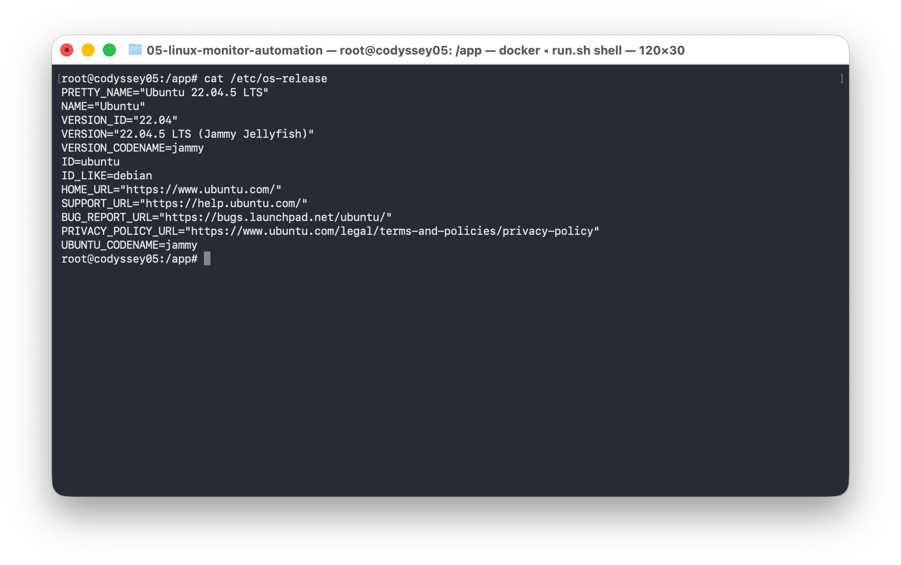

```bash
root@codyssey05:/app# cat /etc/os-release | head -3
PRETTY_NAME="Ubuntu 22.04.x LTS"
NAME="Ubuntu"
VERSION_ID="22.04"
```

#### GLIBC 버전 확인

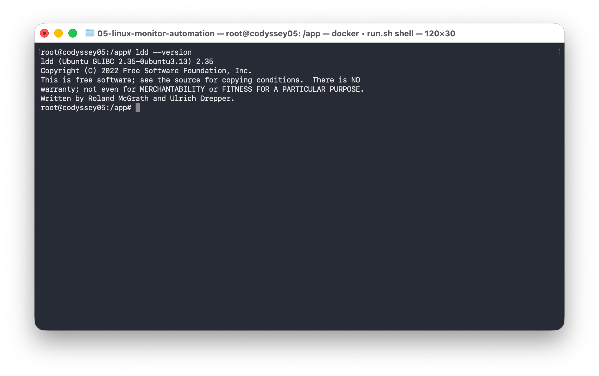

```bash
root@codyssey05:/app# ldd --version | head -1
ldd (Ubuntu GLIBC 2.35-...) 2.35
```

> 이 시점의 GLIBC `2.35`가 나중 Phase 4(agent-app 실행)에서 결정적 문제가 됩니다. 9-1절에서 재현.

### 4-5. 발견된 문제 — 미니멀 Dockerfile에서 패키지 누락

`★ 배경` — GLIBC 비교 데모를 빠르게 보려고 Dockerfile을 *극도로 축소*해서 빌드했음:

```dockerfile
# 미니멀 버전 (apt 없음)
FROM --platform=linux/amd64 ubuntu:22.04
WORKDIR /app
CMD ["/bin/bash"]
```

이 상태로 SSH 단계 진입 시도 → **sshd 명령이 없다는 사실 발견**:

```bash
root@codyssey05:/app# which sshd
(출력 없음)

root@codyssey05:/app# grep -E '^(Port|PermitRootLogin)' /etc/ssh/sshd_config
grep: /etc/ssh/sshd_config: No such file or directory
```

원인:
- `ubuntu:22.04` **base image는 최소한의 패키지만 포함** — bash, coreutils, dpkg, apt 같은 기본 도구만 있고 SSH, UFW, ACL, cron 등은 별도 설치 필요
- 미니멀 Dockerfile에서 `apt install`을 다 빼버려서 본 미션에 필요한 도구가 하나도 없음

#### 4-5-1. 해결책 1 — 컨테이너 안에서 인터랙티브 설치 (학습용)

각 Phase 진입 직전에 필요한 패키지를 그 자리에서 설치. 명령마다 캡쳐를 남길 수 있어서 **"왜 이 패키지를 깔았는가"가 추적 가능**.

**(1) 첫 실수 — `apt-get update` 없이 바로 `apt install` 시도 → 실패**

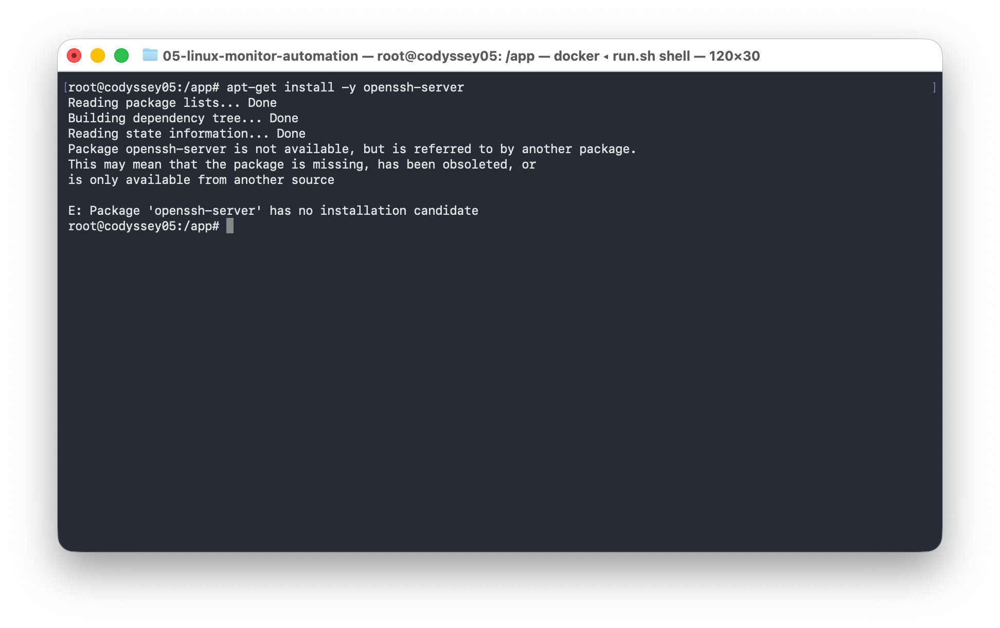

```bash
root@codyssey05:/app# apt-get install -y openssh-server
Reading package lists... Done
Building dependency tree... Done
E: Unable to locate package openssh-server
```

→ 미니멀 base는 빌드 시 `apt clean`으로 인덱스 비워둠. 설치 전 `apt-get update` 로 인덱스 받아야 함.

**(2) `apt-get update` 실행** (캡쳐 생략):

```bash
root@codyssey05:/app# apt-get update
Get:1 http://archive.ubuntu.com/ubuntu jammy InRelease ...
Reading package lists... Done
```

**(3) `openssh-server` 설치**

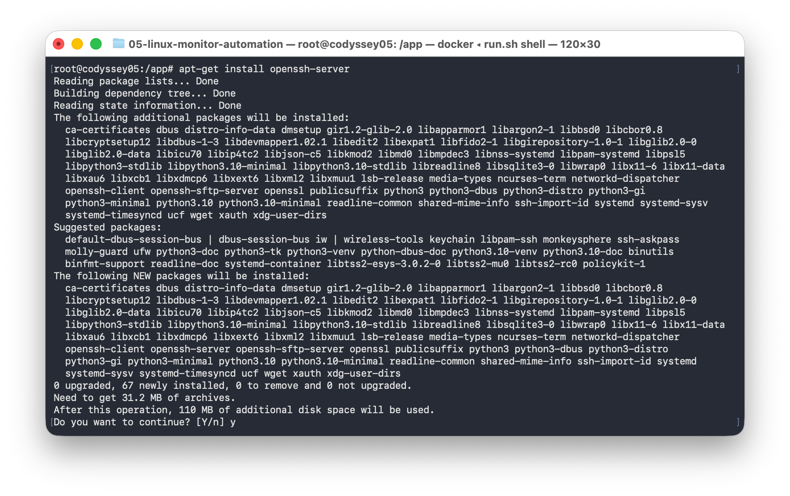

```bash
root@codyssey05:/app# apt-get install -y --no-install-recommends openssh-server
Reading package lists... Done
Building dependency tree... Done
The following NEW packages will be installed:
  openssh-server openssh-sftp-server ssh-import-id ...
Setting up openssh-server (1:8.9p1-3ubuntu0.x) ...
Creating SSH2 RSA key; this may take some time ...
```

> 이 시점에선 `iproute2`(=`ss`)는 깜빡하고 안 설치 — 5-5절에서 발견 후 추가 설치하게 됨.

**(4) 다른 명령들도 차례로 없음 발견 → 인터랙티브 추가 설치 패턴**

이후 Phase별 진입 시 마다 *필요한 도구가 없음을 발견 → 설치* 라는 패턴을 반복합니다. 각각의 캡쳐는 해당 Phase 절에 inline:

| 발견 시점 | 캡쳐 | 누락된 도구 | 설치 명령 |
|-----------|------|-------------|-----------|
| sshd_config 편집 시도 (5단계) | `not-found-01-vim.png` | vi/vim | `apt install vim` |
| 포트 LISTEN 검증 시도 (5-5절) | `apt-03.png` | iproute2(`ss`) | `apt install iproute2` |
| UFW 명령 시도 (6단계) | `not-found-02-ufw.png` | ufw | `apt install ufw iptables` |
| ACL/sudo 사용 시도 (7단계) | (캡쳐 생략) | acl, sudo | `apt install acl sudo` |

> **`--no-install-recommends` 의미**: 추천 패키지 제외, 의존성 필수만. 이미지/컨테이너 크기 최소화에 거의 필수.
> **OpenSSH 호스트 키 자동 생성**: post-install 스크립트가 `ssh-keygen -A` 자동 호출. 출력 로그에 "Creating SSH2 RSA key" 보이면 OK.

#### 4-5-2. Phase 별 필요 패키지 정리

각 단계 진입 직전에 깔아둘 패키지 목록:

| Phase | 필요 패키지 | 용도 |
|-------|--------------|------|
| 1 (SSH) | `openssh-server`, `iproute2` | sshd, `ss` 명령 |
| 2 (UFW) | `ufw`, `iptables` | 방화벽 |
| 3 (권한/ACL) | `acl`, `sudo` | `setfacl`/`getfacl`, `sudo -u` 빙의 |
| 4 (env + agent-app) | (추가 없음) | base만으로 충분 |
| 5 (monitor.sh) | `procps`, `bc`, `gawk` (보통 이미 있음) | `top`, 부동소수점, awk |
| 6 (cron) | `cron`, `logrotate` | 스케줄링, 로그 회전 |

#### 4-5-3. 해결책 2 — 최종적으로 Dockerfile에 통합 (운영용)

학습 단계 종료 후, 인터랙티브로 깔았던 패키지를 Dockerfile에 한 번에 박아 **재현 가능한 환경**을 확보:

```dockerfile
FROM --platform=linux/amd64 ubuntu:24.04
ENV DEBIAN_FRONTEND=noninteractive \
    TZ=Asia/Seoul \
    LANG=C.UTF-8
RUN apt-get update && apt-get install -y --no-install-recommends \
        openssh-server iproute2 \
        ufw iptables \
        acl sudo \
        procps bc \
        cron logrotate \
        vim less curl ca-certificates \
    && ln -sf /usr/share/zoneinfo/$TZ /etc/localtime \
    && rm -rf /var/lib/apt/lists/*
RUN mkdir -p /var/run/sshd
WORKDIR /app
CMD ["/bin/bash"]
```

> **마지막 `rm -rf /var/lib/apt/lists/*`** — apt 인덱스 캐시 삭제로 이미지 100MB 가량 절약. 인터랙티브 컨테이너에선 안 해도 됨.

#### 4-5-4. 학습 포인트

- **이미지 layer 캐시**: Dockerfile의 `RUN apt-get install`은 한 번 실행되고 layer로 저장됨 → 다음 빌드 시 그 layer를 재사용. apt 자주 바뀌면 layer 캐시가 깨져서 느려짐.
- **base image의 철학**: Ubuntu base는 *"최소한의 init + apt 도구"* 만 가짐. 실제 운영에선 `apt install` 추가가 거의 필수.
- **"인터랙티브 설치 → Dockerfile 통합" 패턴**: 새 서비스 셋업 시 흔한 워크플로우. 컨테이너 안에서 시행착오로 패키지 찾고, 안정되면 Dockerfile에 박는 게 정석.

### 4-6. 컨테이너 PID 1 — 좀비(defunct) 함정

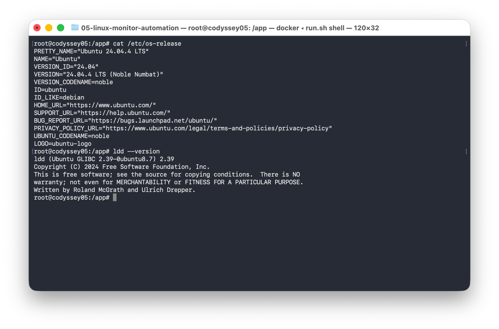

```bash
# --init 없이 띄운 경우, cron이 매분 monitor.sh를 띄우면
root@codyssey05:/app# ps -ef | grep defunct
agent-a+    60     1  0 12:30 ?  00:00:00 [agent-app] <defunct>
root       575     1  0 12:31 ?  00:00:00 [sudo] <defunct>
```

좀비는 부모 프로세스가 `wait()` 해줘야 사라집니다. `tail -f /dev/null`은 wait 안 함 → tini가 그 역할을 대신 맡아 자동 reaping.

해결:
```bash
docker run -d --init ...   # tini가 PID 1 → 자동 reaping
```

---

## 5. SSH 보안 설정

### 5-0. 트러블슈팅 — `vi` / `vim` 미설치 발견

설정 파일 수정하려고 `vi` 호출 → 명령 없음.

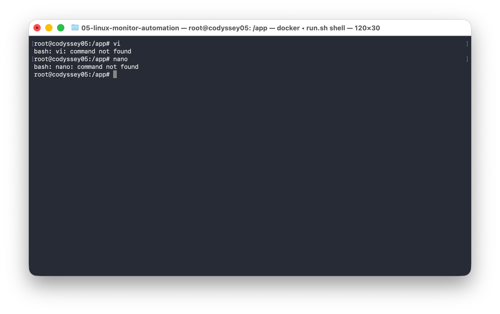

```bash
root@codyssey05:/app# vi /etc/ssh/sshd_config
bash: vi: command not found

root@codyssey05:/app# nano /etc/ssh/sshd_config
bash: nano: command not found
```

해결 — `vim` 설치:

```bash
root@codyssey05:/app# apt-get install -y --no-install-recommends vim
...
Setting up vim ...

root@codyssey05:/app# which vim && vim --version | head -1
/usr/bin/vim
VIM - Vi IMproved 8.2 ...
```

> 미니멀 base 이미지는 `vi`도 없다는 사실. 운영 자동화 측면에선 `sed` 가 더 권장되지만 학습 단계엔 vim이 편함.

### 5-1. sshd_config 변경 — 현재 상태 확인

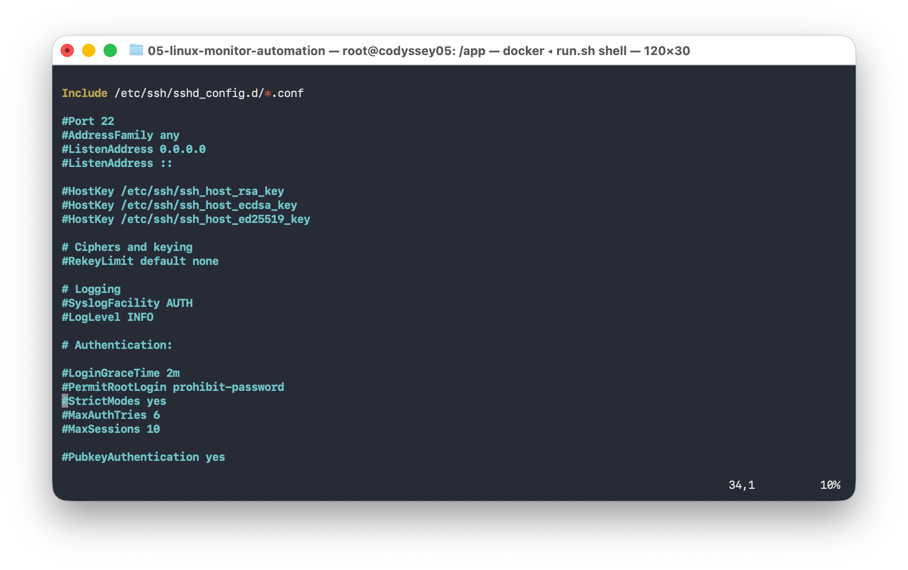

```bash
# 변경 전 — Port, PermitRootLogin이 주석 처리되어 있음 (vi 안에서 확인)
root@codyssey05:/app# vi /etc/ssh/sshd_config
```

vi 안에서 확인되는 기본 라인:
```
#Port 22
#PermitRootLogin prohibit-password
```

### 5-2. sshd_config 변경 — Port + PermitRootLogin

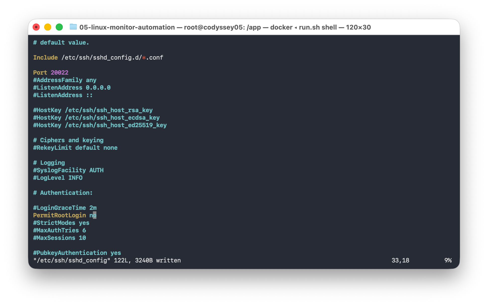

vi에서 두 라인을 다음과 같이 수정:

```
Port 20022
PermitRootLogin no
```

`:wq` 로 저장 후 vi 종료.

> 자동화 친화적 대안 (sed):
> ```bash
> sed -i '/^[#[:space:]]*Port[[:space:]]/d'             /etc/ssh/sshd_config
> sed -i '/^[#[:space:]]*PermitRootLogin[[:space:]]/d'  /etc/ssh/sshd_config
> echo -e "\nPort 20022\nPermitRootLogin no" >> /etc/ssh/sshd_config
> ```

### 5-2-a. `PermitRootLogin` 옵션 상세

OpenSSH의 `PermitRootLogin` 디렉티브는 root 계정의 원격 로그인 정책을 결정합니다. 4가지 값 중 하나를 가집니다.

| 값 | 의미 |
|----|------|
| `yes` | root 로그인 완전 허용 (비밀번호 + 키 모두) |
| `prohibit-password` | root 로그인 허용하되 **공개키 인증만** 가능 (Ubuntu 22.04+ 기본값) |
| `forced-commands-only` | 미리 등록된 명령만 실행 가능 (`authorized_keys`의 `command=` 옵션) |
| **`no`** | **root 원격 로그인 전면 차단** ← 이번 미션 정답 |

### 5-3. 문법 검증 — `/run/sshd` 함정 + sshd_config 재확인

#### 첫 시도 — `Missing privilege separation directory` 에러

(캡쳐 생략, 텍스트로 흐름 기록)

```bash
root@codyssey05:/app# sshd -t
Missing privilege separation directory: /run/sshd
```

#### 원인

- sshd는 **Privilege Separation** 패턴으로 동작: master(root) + worker(unprivileged) 두 프로세스로 분리
- worker가 chroot할 디렉터리로 `/run/sshd` 가 필요
- 일반 리눅스 시스템에선 systemd의 `RuntimeDirectory=sshd` 설정으로 자동 생성
- **Docker 컨테이너엔 systemd가 없음** → 자동 생성 안 됨
- `/run` 은 tmpfs(메모리)라 매번 비어있는 상태로 시작

#### 해결 — `/run/sshd` 수동 생성 + 재검증

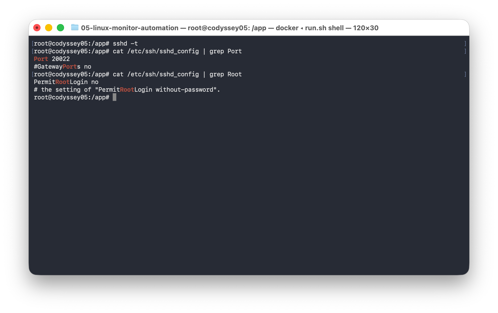

```bash
root@codyssey05:/app# mkdir -p /run/sshd
root@codyssey05:/app# chmod 0755 /run/sshd

# 다시 문법 검증
root@codyssey05:/app# sshd -t
(출력 없음 = 정상)

# sshd_config 변경사항 재확인 (vi 저장이 잘 됐는지)
root@codyssey05:/app# grep -E '^(Port|PermitRootLogin)' /etc/ssh/sshd_config
Port 20022
PermitRootLogin no
```

> **영구 해결 — Dockerfile에 박기**
> ```dockerfile
> RUN mkdir -p /var/run/sshd   # /var/run/sshd 는 /run/sshd 의 심볼릭 링크
> ```
> 인터랙티브 fix는 컨테이너 수명까지만 유효. 컨테이너 재기동/재생성 시 다시 사라지므로 Dockerfile에 추가가 정석.

### 5-4. 데몬 재기동 — `systemctl` vs `service`

#### 첫 시도 — `systemctl`은 컨테이너에서 동작 안 함

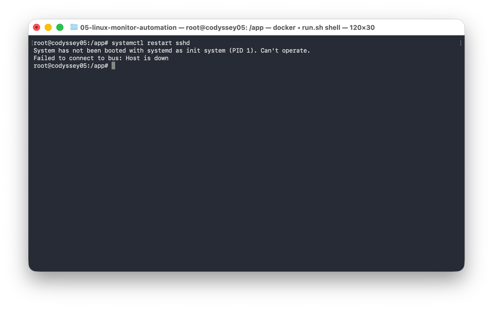

```bash
root@codyssey05:/app# systemctl restart ssh
System has not been booted with systemd as init system (PID 1). Can't operate.
Failed to connect to bus: Host is down
```

#### 해결 — `service` 명령 사용

(캡쳐 생략, 텍스트로 흐름 기록)

```bash
root@codyssey05:/app# service ssh restart
 * Restarting OpenBSD Secure Shell server sshd                                  [ OK ]
```

#### 원인 — 컨테이너엔 systemd가 없음

- `systemctl` 은 systemd init 시스템과 D-Bus를 통해 통신하는 클라이언트
- Docker 컨테이너의 PID 1은 보통 **`tini`**(`--init` 옵션 사용 시) 또는 **앱 프로세스** — systemd가 아님
- 그래서 `systemctl` 호출 시 "System has not been booted with systemd" 에러 발생

#### 해결 — `service` 명령 사용

- `service`는 Ubuntu/Debian이 systemd / upstart / sysvinit 어떤 init이든 호환되게 wrapping한 도구
- 컨테이너에선 내부적으로 `/etc/init.d/<name>`(sysvinit 스크립트)를 직접 호출
- 따라서 systemd 없이도 데몬을 시작/정지/재기동 가능

#### 운영 환경별 명령 정리

| 환경 | 데몬 재기동 명령 | init 시스템 |
|------|------------------|-------------|
| 일반 Ubuntu/Debian 서버 (VM/베어메탈) | `systemctl restart ssh` | systemd |
| Docker 컨테이너 (`--init` 또는 일반) | **`service ssh restart`** | tini / 앱 직접 |
| systemd-enabled 컨테이너 (특수 셋업) | `systemctl restart ssh` | systemd (드물게) |
| 오래된 시스템 (Ubuntu 14.04 이전) | `service ssh restart` 또는 `/etc/init.d/ssh restart` | sysvinit/upstart |

> **`sshd -t` 먼저, 그 다음 restart** 순서가 운영자 필수 습관. 문법 오류가 있는 채로 restart 하면 sshd가 죽고 새 SSH 접속이 불가능해집니다. 원격 서버라면 그 즉시 잠겨버립니다.

`★ Insight ─────────────────────────────────────`
- **컨테이너에서 systemd 안 쓰는 이유**: Docker 철학은 *"한 컨테이너당 한 프로세스"*. systemd는 *수십 개 데몬을 관리하는 init 시스템* — 컨테이너 모델과 맞지 않음. 그래서 컨테이너 안엔 보통 init 자체가 없거나 가벼운 tini 정도만 있음.
- **`service` 명령은 사실상 폐기 예정 상태**입니다 (Debian에선 systemctl 권장). 다만 컨테이너에선 여전히 유일한 대안. 호환성 wrapper로 남아있어 다행.
- 운영자가 컨테이너 디버깅 시 가장 자주 헷갈리는 게 이것. **VM에서 통하는 명령이 컨테이너에선 안 통한다**는 인지가 컨테이너 운영의 시작점.
`─────────────────────────────────────────────────`

### 5-5. 트러블슈팅 — `ss` 미설치 발견 → iproute2 설치

LISTEN 검증을 위해 `ss` 명령 호출 → 없음:

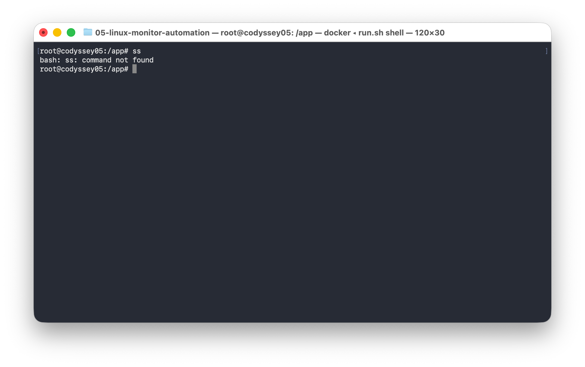

```bash
root@codyssey05:/app# ss -tlnp
bash: ss: command not found
```

해결 — `iproute2` 설치 (`ss` 외에도 `ip`, `tc` 등이 같이 들어옴):

```bash
root@codyssey05:/app# apt-get install -y --no-install-recommends iproute2
...
Setting up iproute2 ...

root@codyssey05:/app# which ss
/usr/bin/ss
```

> 처음 4-5절에서 `openssh-server`만 설치하고 `iproute2`를 빠뜨린 결과. 인터랙티브 환경의 함정 — *나중 단계에서 발견* → *추가 설치 반복*. 안정화 후 Dockerfile에 한 번에 박는 게 정석.

### 5-6. 포트 LISTEN 검증

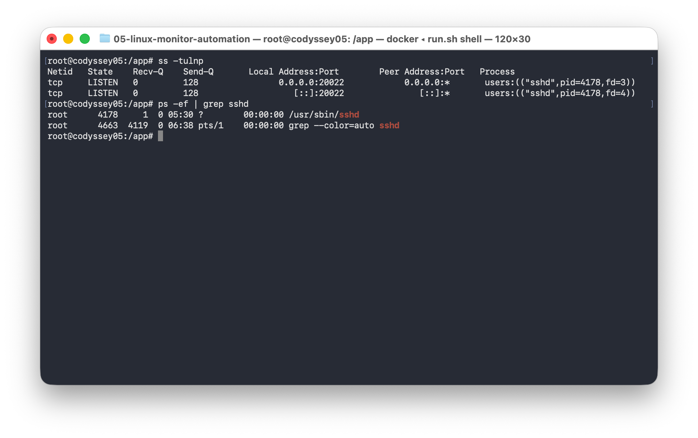

```bash
root@codyssey05:/app# ss -tlnp | grep sshd
LISTEN 0  128  0.0.0.0:20022  0.0.0.0:*  users:(("sshd",pid=41,fd=3))
LISTEN 0  128  [::]:20022     [::]:*     users:(("sshd",pid=41,fd=4))

root@codyssey05:/app# ps -ef | grep -v grep | grep sshd
root  41  1  0  ...  sshd: /usr/sbin/sshd -D [listener] 0 of 10-100 startups
```

> **`ss` + `ps` 같이 보기**: ss는 *어느 포트가 LISTEN* 인지 보여주고, ps는 *어떤 프로세스가 그걸 잡고 있는지* 확인. 운영 디버깅의 정석 콤보.

### 5-7. 호스트(macOS)에서 SSH 도달 검증

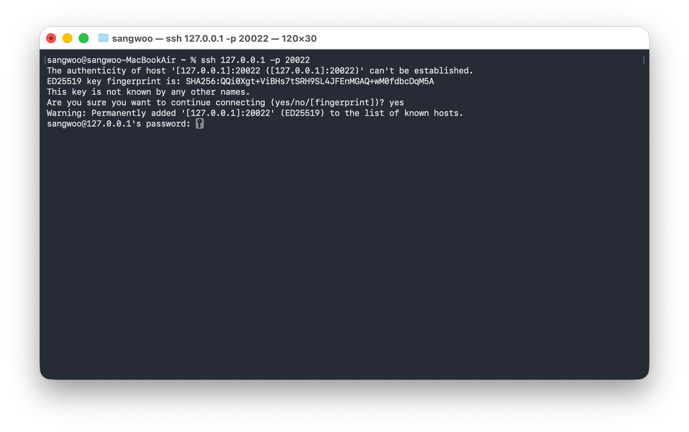

```bash
# 호스트(macOS) 터미널에서 — Docker 포트 매핑이 정상 동작하는지
sangwoo@sangwoo-MacBookAir % ssh -p 20022 root@localhost
root@localhost: Permission denied (publickey,password).
```

→ 위 결과는 **정상 동작 증거**: 연결은 성공해서 sshd가 응답했고, `PermitRootLogin no` 정책에 의해 거부됨. 즉 *포트 도달성* + *root 차단 정책* 둘 다 검증.

> **포트 변경의 보안 의미**: "공격을 막는다"가 아니라 "자동화된 봇넷 스캔 noise를 99% 줄인다"가 본질. 22 → 20022 변경으로 brute-force 로그가 사라지고, 진짜 의심 시도(20022로 들어오는 시도)가 신호로 떠오릅니다.

---

## 6. UFW 방화벽 화이트리스트

### 6-0. 트러블슈팅 — `ufw` 미설치 발견

UFW 정책 설정하려고 `ufw` 호출 → 없음:

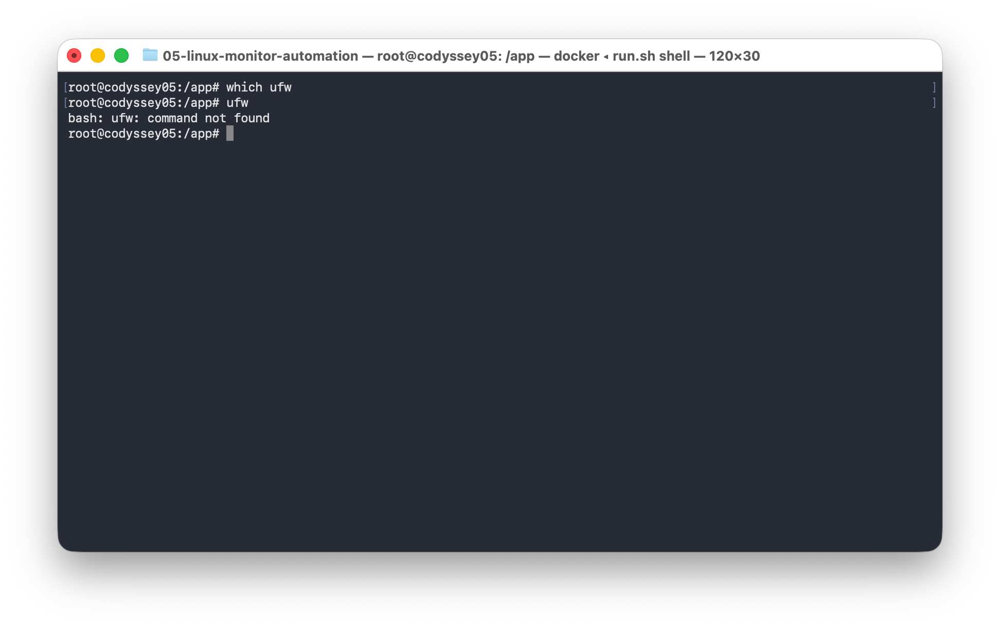

```bash
root@codyssey05:/app# ufw status
bash: ufw: command not found
```

해결 — `ufw` + `iptables` 설치 (UFW는 iptables의 wrapper):

```bash
root@codyssey05:/app# apt-get install -y --no-install-recommends ufw iptables
...
Setting up ufw ...
Setting up iptables ...

root@codyssey05:/app# which ufw && ufw --version
/usr/sbin/ufw
ufw 0.36.1
```

> **`ufw` 만 설치하면 iptables 명령이 없어 enable 시 실패합니다**. 둘 다 설치 필수.

### 6-1. 정책 설정 + 활성화

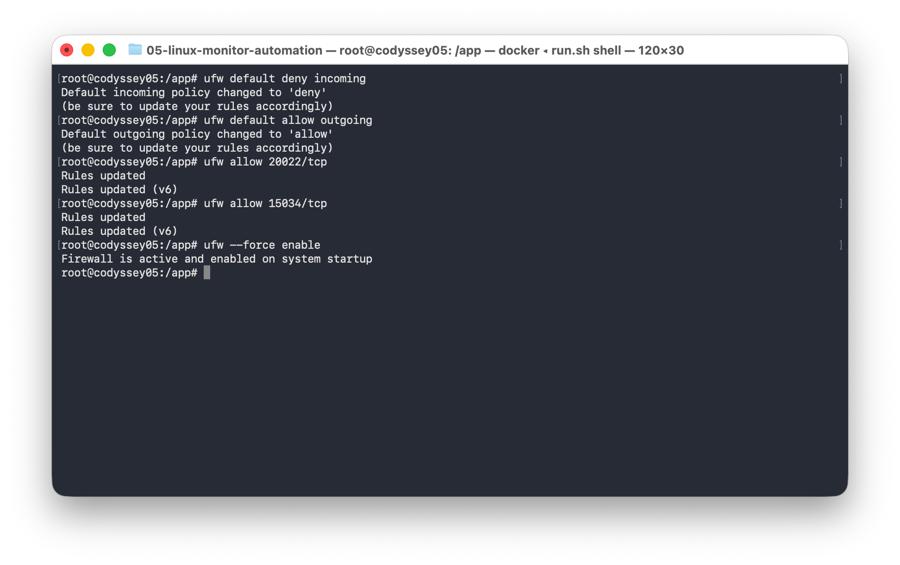

```bash
# (1) 기본 정책 — deny incoming + allow outgoing
root@codyssey05:/app# ufw default deny incoming
Default incoming policy changed to 'deny'
root@codyssey05:/app# ufw default allow outgoing
Default outgoing policy changed to 'allow'

# (2) 허용 포트 두 개
root@codyssey05:/app# ufw allow 20022/tcp
Rules updated
Rules updated (v6)
root@codyssey05:/app# ufw allow 15034/tcp
Rules updated
Rules updated (v6)

# (3) UFW 활성화
root@codyssey05:/app# ufw --force enable
Firewall is active and enabled on system startup
```

> **`--force`는 비대화형(non-interactive)** 옵션 — `Command may disrupt existing ssh connections. Proceed with operation (y|n)?` 같은 프롬프트를 자동 yes 처리.

### 6-2. 정책 검증

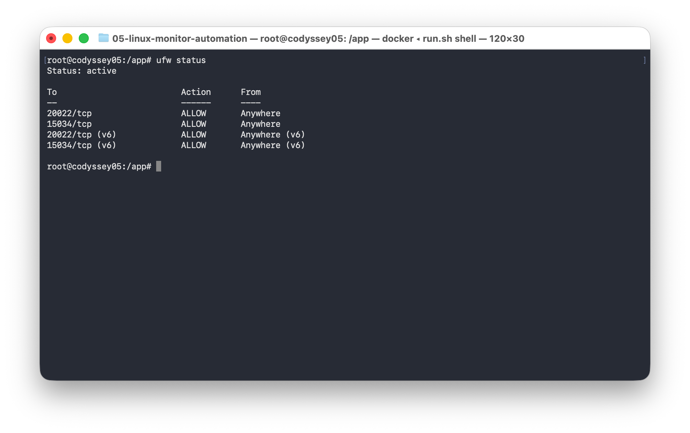

```bash
root@codyssey05:/app# ufw status verbose
Status: active
Logging: on (low)
Default: deny (incoming), allow (outgoing), deny (routed)
New profiles: skip

To                         Action      From
--                         ------      ----
20022/tcp                  ALLOW IN    Anywhere
15034/tcp                  ALLOW IN    Anywhere
20022/tcp (v6)             ALLOW IN    Anywhere (v6)
15034/tcp (v6)             ALLOW IN    Anywhere (v6)
```

> **화이트리스트 정책의 의미**: `default deny + allow 특정`은 "새 서비스 추가 시 명시적 허용 필요" → 누락에 의한 노출 사고를 막는 정석. 반대 패턴(`default allow + deny 특정`)은 블랙리스트라 부르며 보안 사고가 잘 납니다.

---

## 7. 계정 / 그룹 / 디렉터리 / 권한 / ACL

### 7-1. 그룹 생성

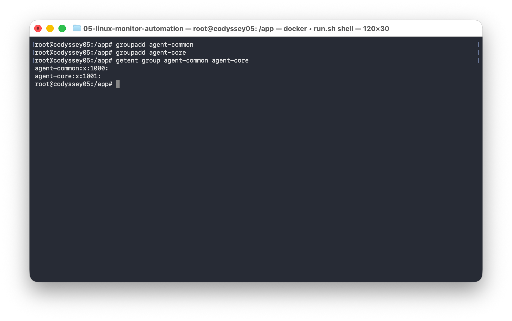

```bash
root@codyssey05:/app# groupadd agent-common
root@codyssey05:/app# groupadd agent-core
root@codyssey05:/app# getent group agent-common agent-core
agent-common:x:1001:
agent-core:x:1002:
```

### 7-2. 사용자 생성 (보조 그룹 동시 가입)

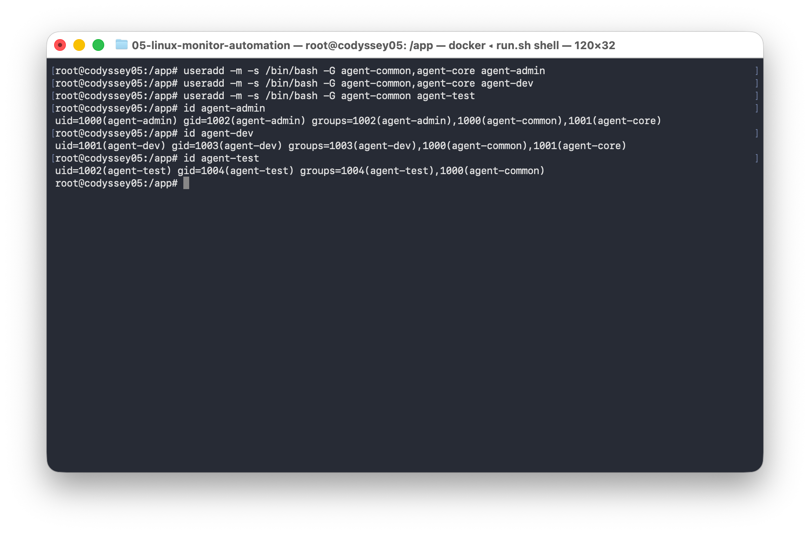

```bash
root@codyssey05:/app# useradd -m -s /bin/bash -G agent-common,agent-core agent-admin
root@codyssey05:/app# useradd -m -s /bin/bash -G agent-common,agent-core agent-dev
root@codyssey05:/app# useradd -m -s /bin/bash -G agent-common              agent-test

root@codyssey05:/app# id agent-admin
uid=1001(agent-admin) gid=1003(agent-admin) groups=1003(agent-admin),1001(agent-common),1002(agent-core)
root@codyssey05:/app# id agent-dev
uid=1002(agent-dev)   gid=1004(agent-dev)   groups=1004(agent-dev),1001(agent-common),1002(agent-core)
root@codyssey05:/app# id agent-test
uid=1003(agent-test)  gid=1005(agent-test)  groups=1005(agent-test),1001(agent-common)
```

> **`-m -s -G` 옵션 해석**
> - `-m` : 홈 디렉터리 자동 생성 (`/home/<user>`)
> - `-s /bin/bash` : 로그인 셸 지정
> - `-G common,core` : 보조 그룹 가입 (콤마 구분, 공백 없음)

### 7-3. 디렉터리 트리 + 권한 + ACL

#### 7-3-1. 메커니즘 비교 — 무엇이 무엇을 책임지나

미션의 권한 정책을 구현하는 데 사용 가능한 메커니즘은 세 가지이며, 각각 책임 영역이 다르다.

| 메커니즘 | 책임 | 본 미션 필요성 |
|----------|------|----------------|
| **POSIX 권한** (`chmod 770`, `chown :group`) | owner / 그룹 / others의 rwx 정의 — *현재 디렉터리에 대한* 기본 접근 정책 | **필수** — 미션 명시 |
| **setgid (`2xxx`)** | 새 파일/디렉터리가 *부모의 그룹*을 자동 상속 (group 하나만) | **핵심** — 운영 위생 |
| **default ACL** (`setfacl -d -m`) | 새 파일/디렉터리에 *그룹·권한 비트 전체*를 자동 적용 (다중 그룹 가능) | 보조 — 미션 평가 증거 |

**미션 정책 입장에서의 차이**:
- 우리 정책은 *디렉터리 당 단일 그룹*(upload_files=common, api_keys=core) → **setgid 만으로도 충분**
- default ACL은 *기능적으론 setgid와 겹치는 부분이 큼*. 다만 미션 체크리스트 *"디렉터리 구조 및 권한(ACL 포함) 확인 내역"* 충족을 위한 **getfacl 증거**가 필요해 함께 적용.

> **만약 setgid 없이 `chmod 770`만** 했다면?
> agent-dev가 `api_keys/` 안에 만든 새 파일의 그룹이 `agent-dev`(primary)로 박혀버려, agent-admin이 접근 못하는 *정책 위반*이 발생. setgid가 이를 막아줌.

> **만약 ACL 없이 setgid만** 적용했다면?
> 기능적으론 미션 정책 충족. 다만 `getfacl` 출력에 default ACL 라인이 없어 평가 체크리스트의 *"ACL 포함"* 항목이 비어 보임.

#### 7-3-2. 적용 명령

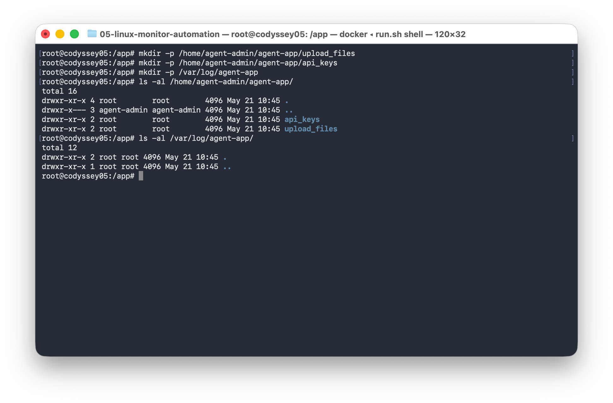

```bash
# 디렉터리 트리
root@codyssey05:/app# mkdir -p /home/agent-admin/agent-app/upload_files \
>                              /home/agent-admin/agent-app/api_keys \
>                              /var/log/agent-app
```

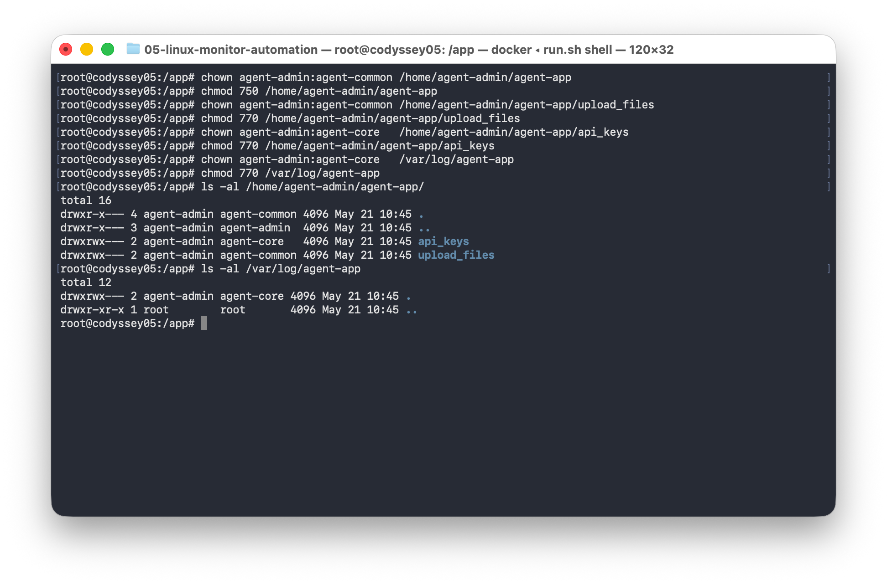

```bash
# 소유권 + setgid (2xxx) — 새 파일이 부모 그룹 자동 상속
root@codyssey05:/app# chown agent-admin:agent-common /home/agent-admin/agent-app
root@codyssey05:/app# chmod 2750                     /home/agent-admin/agent-app

root@codyssey05:/app# chown agent-admin:agent-common /home/agent-admin/agent-app/upload_files
root@codyssey05:/app# chmod 2770                     /home/agent-admin/agent-app/upload_files

root@codyssey05:/app# chown agent-admin:agent-core   /home/agent-admin/agent-app/api_keys
root@codyssey05:/app# chmod 2770                     /home/agent-admin/agent-app/api_keys

root@codyssey05:/app# chown agent-admin:agent-core   /var/log/agent-app
root@codyssey05:/app# chmod 2770                     /var/log/agent-app
```

> **⚠️ 본 사이클 실제 적용 상태**: 위 블록은 *학습용 표준 형태* (setgid 포함). 실제 `setup-mission.sh` 는 자연 발견 흐름을 위해 setgid 비트 없는 `chmod 750/770` 으로 적용 — § 11-4 에서 monitor.log 그룹 비일관을 직접 관찰하고 § 11-6 에서 보류 결정 (부록 C M1).

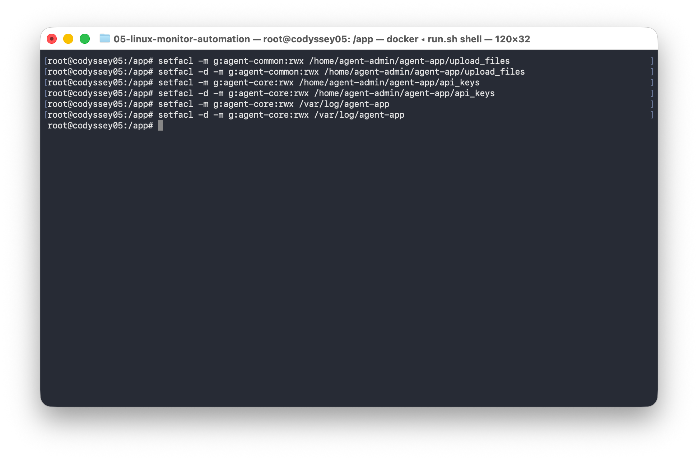

```bash
# 기본 ACL — setgid 와 *중복되는 안전망* + 미션 체크리스트 증거
root@codyssey05:/app# setfacl -m  g:agent-common:rwx /home/agent-admin/agent-app/upload_files
root@codyssey05:/app# setfacl -d -m g:agent-common:rwx /home/agent-admin/agent-app/upload_files
root@codyssey05:/app# setfacl -m  g:agent-core:rwx   /home/agent-admin/agent-app/api_keys
root@codyssey05:/app# setfacl -d -m g:agent-core:rwx /home/agent-admin/agent-app/api_keys
root@codyssey05:/app# setfacl -m  g:agent-core:rwx   /var/log/agent-app
root@codyssey05:/app# setfacl -d -m g:agent-core:rwx /var/log/agent-app
```

> **모드/명령 해석**
> - **`2`(setgid)** — 그룹 상속의 핵심. 없으면 새 파일의 그룹이 *생성자 primary*로 박혀 정책 깨짐.
> - **`770`** — 소유자/그룹 rwx, others 차단.
> - **`setfacl -m`** — 현재 디렉터리에 ACL 추가
> - **`setfacl -d -m`** — default ACL (앞으로 만들어질 파일에 자동 적용)
>
> setgid가 그룹 상속을 처리하고, 권한 비트는 umask + setgid 조합으로 결정됨. default ACL은 *추가 명시적 보장*.

### 7-4. 권한 검증 — `ls -la` + `getfacl`


```bash
root@codyssey05:/app# ls -la /home/agent-admin/agent-app/
total 16
drwxr-s---  4 agent-admin agent-common 4096 May 12 16:40 .
drwxr-x---  3 agent-admin agent-admin  4096 May 12 16:40 ..
drwxrws---+ 2 agent-admin agent-core   4096 May 12 16:40 api_keys
drwxrws---+ 2 agent-admin agent-common 4096 May 12 16:40 upload_files

root@codyssey05:/app# getfacl /home/agent-admin/agent-app/api_keys
# file: home/agent-admin/agent-app/api_keys
# owner: agent-admin
# group: agent-core
# flags: -s-
user::rwx
group::rwx
group:agent-core:rwx
mask::rwx
other::---
default:user::rwx
default:group::rwx
default:group:agent-core:rwx
default:mask::rwx
default:other::---
```

> **`drwxrws---+`의 해석**
> - `s` (group 위치) — setgid 비트 활성
> - `+` (끝) — POSIX ACL이 추가로 걸려있다는 표시
> - `getfacl`로 default ACL이 같이 걸린 것 확인

### 7-5. 첫 검증에서 발견된 문제 — 부모 디렉터리 traverse


```bash
# 빙의 권한 테스트
root@codyssey05:/app# sudo -u agent-test touch /home/agent-admin/agent-app/upload_files/ok.txt
touch: cannot touch '/home/agent-admin/agent-app/upload_files/ok.txt': Permission denied   # ❌ 성공해야 함
root@codyssey05:/app# sudo -u agent-dev  touch /home/agent-admin/agent-app/api_keys/ok_dev.txt
touch: cannot touch '/home/agent-admin/agent-app/api_keys/ok_dev.txt': Permission denied    # ❌ 성공해야 함

# 원인 추적 — ls -ld 로 path 거슬러 올라가기
root@codyssey05:/app# ls -ld / /home /home/agent-admin /home/agent-admin/agent-app /home/agent-admin/agent-app/api_keys
drwxr-xr-x  1 root        root         /
drwxr-xr-x  1 root        root         /home
drwxr-x---  3 agent-admin agent-admin  /home/agent-admin               ← 여기!
drwxr-s---  4 agent-admin agent-common /home/agent-admin/agent-app
drwxrws---+ 2 agent-admin agent-core   /home/agent-admin/agent-app/api_keys
```

> **Ubuntu 24.04 함정**: `useradd -m` 기본 권한이 **750 + 그룹=자기 자신** (22.04는 755)
> - agent-dev/test는 `agent-admin` 그룹 멤버 아님 → `/home/agent-admin` 트래버스 불가
> - 자식 디렉터리 권한이 아무리 열려있어도 부모에서 막히면 무의미

### 7-6. 수정 — `/home/agent-admin` 그룹 변경


```bash
root@codyssey05:/app# chown agent-admin:agent-common /home/agent-admin
root@codyssey05:/app# chmod 750                       /home/agent-admin
root@codyssey05:/app# ls -ld /home/agent-admin
drwxr-x--- 3 agent-admin agent-common 4096 May 12 16:40 /home/agent-admin

# 재검증
root@codyssey05:/app# sudo -u agent-test touch /home/agent-admin/agent-app/upload_files/ok_test.txt
root@codyssey05:/app# sudo -u agent-dev  touch /home/agent-admin/agent-app/api_keys/ok_dev.txt
(둘 다 출력 없음 = 성공)

root@codyssey05:/app# ls -la /home/agent-admin/agent-app/upload_files/ok_test.txt
-rw-rw----+ 1 agent-test agent-common 0 May 12 16:42 .../ok_test.txt   ← test가 만들었는데 그룹은 common (setgid 효과)

root@codyssey05:/app# ls -la /home/agent-admin/agent-app/api_keys/ok_dev.txt
-rw-rw----+ 1 agent-dev  agent-core   0 May 12 16:42 .../ok_dev.txt    ← dev가 만들었는데 그룹은 core (setgid 효과)
```

### 7-7. ✅ 최종 권한 차단 동작 검증

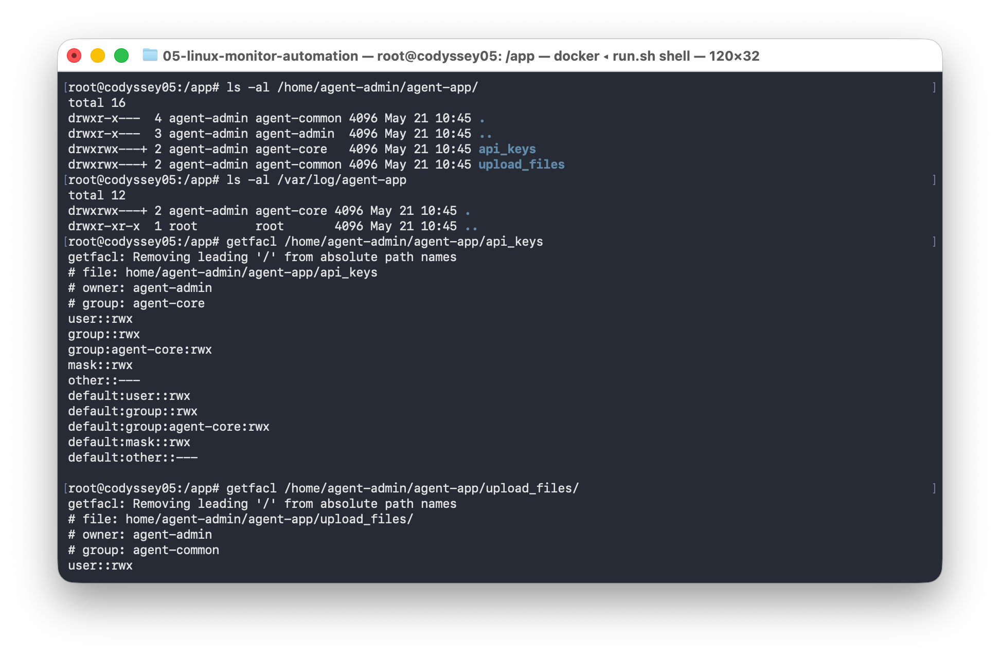

```bash
root@codyssey05:/app# echo '=== agent-test 빙의 ==='
=== agent-test 빙의 ===
root@codyssey05:/app# sudo -u agent-test touch /home/agent-admin/agent-app/upload_files/ok.txt        # ✅ 성공 (agent-common)
root@codyssey05:/app# sudo -u agent-test touch /home/agent-admin/agent-app/api_keys/should_fail.txt   # ❌ 차단 (agent-core 아님)
touch: cannot touch '/home/agent-admin/agent-app/api_keys/should_fail.txt': Permission denied
root@codyssey05:/app# sudo -u agent-test touch /var/log/agent-app/should_fail.txt                    # ❌ 차단
touch: cannot touch '/var/log/agent-app/should_fail.txt': Permission denied

root@codyssey05:/app# echo '=== agent-dev 빙의 ==='
=== agent-dev 빙의 ===
root@codyssey05:/app# sudo -u agent-dev touch /home/agent-admin/agent-app/api_keys/ok_dev.txt        # ✅ 성공
root@codyssey05:/app# sudo -u agent-dev touch /var/log/agent-app/ok_dev.txt                          # ✅ 성공
```

> **권한 디버깅 1번 규칙**: leaf만 보지 말고 `ls -ld`로 path 전체를 한 단계씩 거슬러 올라가기. 권한 검사는 path 전체에서 traverse(x) 비트를 누적 확인합니다.

---

## 8. 환경 변수 + 키 파일

### 8-1. 환경 변수 설정 방식 — 의사결정

리눅스에서 환경 변수를 "고정"하는 방법은 6가지 이상이며, 각각 동작 시점이 다릅니다.

| # | 위치 | 스코프 | login | non-login | cron | 단점 |
|---|------|--------|-------|-----------|------|------|
| A | `~/.bashrc` | 사용자별 | (간접) | ✅ | ❌ | **cron 미반영** |
| B | `~/.profile` | 사용자별 | ✅ | ❌ | ❌ | cron 미반영 |
| C | `/etc/environment` | 전체 | ✅ | ✅ | ✅ | **shell 확장 불가** (`$VAR` 참조 X) |
| D | `/etc/profile.d/*.sh` | 전체 | ✅ | ❌ | ❌ | 모든 계정 노출 |
| E | envfile + 명시적 `source` | source한 자만 | source시 | source시 | ✅ | 호출자 매번 source |
| F | crontab 내부 `VAR=value` | 해당 cron만 | ❌ | ❌ | ✅ | 정의 분산 |

**`export`의 의미**

```bash
FOO=hello          # 셸 변수 (자식 프로세스가 못 봄)
export FOO         # 환경 변수로 승격 (자식 프로세스 환경에 들어감)
export BAR=hi      # 위 두 줄 한꺼번에
```

`bash -c 'echo $FOO'`로 자식을 띄워 보면 차이가 드러납니다:
- `FOO=hello` 만 한 경우 → 자식 출력 빈 줄
- `export FOO` 까지 한 경우 → 자식 출력 `hello`

→ envfile에 5개 변수를 적을 때 반드시 **`export VAR=value`** 형식으로. `export` 빠뜨리면 셸 내부에서만 보이고 agent-app은 못 봅니다.

**본 미션의 선택: B + E 조합** (envfile + `.profile` source)

이유:
1. **단일 진실의 원천(SSOT)** — 5개 변수 정의가 한 파일(`agent-app.env`)에만 존재
2. **cron 호환** — monitor.sh가 cron으로 매분 실행되므로 cron 환경에서도 변수가 보장돼야 함. `.profile`만으론 cron이 변수를 못 봄
3. **스코프 최소화** — 시스템 전체 노출(`/etc/profile.d/`)보다 agent-admin 전용이 더 적절

### 8-2. envfile 생성

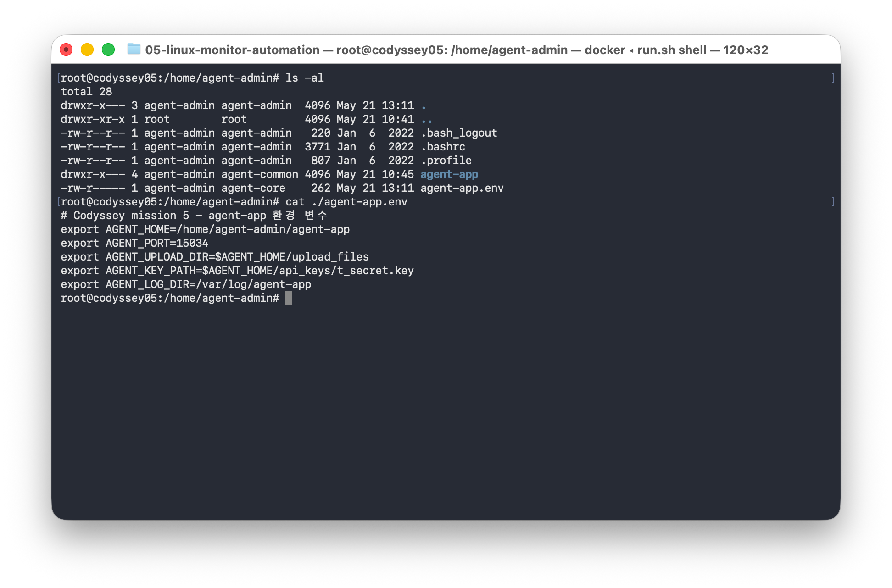

```bash
root@codyssey05:/app# cat > /home/agent-admin/agent-app.env <<'EOF'
> export AGENT_HOME=/home/agent-admin/agent-app
> export AGENT_PORT=15034
> export AGENT_UPLOAD_DIR=$AGENT_HOME/upload_files
> export AGENT_KEY_PATH=$AGENT_HOME/api_keys/t_secret.key
> export AGENT_LOG_DIR=/var/log/agent-app
> EOF

root@codyssey05:/app# chown agent-admin:agent-core /home/agent-admin/agent-app.env
root@codyssey05:/app# chmod 640                    /home/agent-admin/agent-app.env

root@codyssey05:/app# ls -la /home/agent-admin/agent-app.env
-rw-r----- 1 agent-admin agent-core 232 May 12 16:18 /home/agent-admin/agent-app.env
```

### 8-3. `.profile` 에서 envfile source

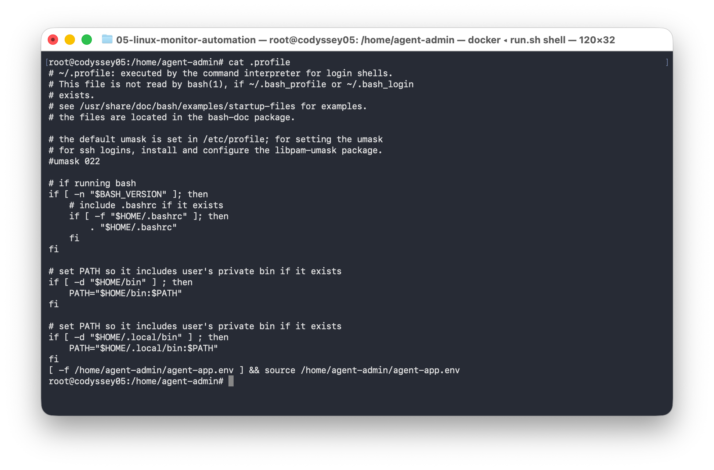

```bash
root@codyssey05:/app# cat >> /home/agent-admin/.profile <<'EOF'
> 
> # Codyssey mission 5 - envfile auto load
> [ -f /home/agent-admin/agent-app.env ] && source /home/agent-admin/agent-app.env
> EOF

root@codyssey05:/app# chown agent-admin:agent-admin /home/agent-admin/.profile
root@codyssey05:/app# tail -3 /home/agent-admin/.profile

# Codyssey mission 5 - envfile auto load
[ -f /home/agent-admin/agent-app.env ] && source /home/agent-admin/agent-app.env
```

### 8-4. 키 파일 생성

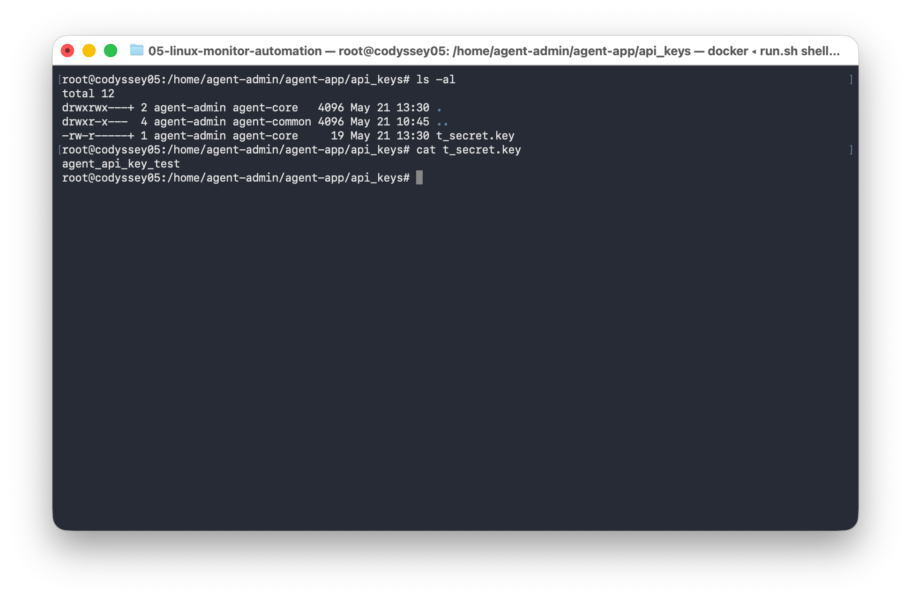

```bash
root@codyssey05:/app# echo 'agent_api_key_test' > /home/agent-admin/agent-app/api_keys/t_secret.key
root@codyssey05:/app# chown agent-admin:agent-core /home/agent-admin/agent-app/api_keys/t_secret.key
root@codyssey05:/app# chmod 640                    /home/agent-admin/agent-app/api_keys/t_secret.key

root@codyssey05:/app# ls -la /home/agent-admin/agent-app/api_keys/t_secret.key
-rw-r-----+ 1 agent-admin agent-core 19 May 15 12:18 /home/agent-admin/agent-app/api_keys/t_secret.key

root@codyssey05:/app# cat /home/agent-admin/agent-app/api_keys/t_secret.key
agent_api_key_test
```

### 8-5. fine-grained sudo (monitor.sh의 ufw status 호출용)

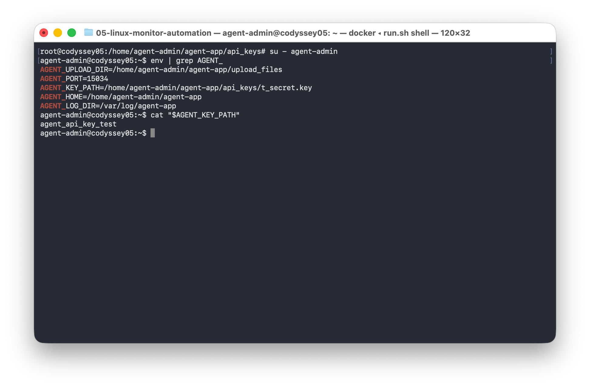

```bash
# /etc/sudoers.d/agent-admin-monitor — read-only ufw status 만 패스워드 없이 허용
root@codyssey05:/app# cat > /etc/sudoers.d/agent-admin-monitor <<'EOF'
> agent-admin ALL=(root) NOPASSWD: /usr/sbin/ufw status
> EOF
root@codyssey05:/app# chmod 0440 /etc/sudoers.d/agent-admin-monitor

# 문법 검증 (visudo -cf)
root@codyssey05:/app# visudo -cf /etc/sudoers.d/agent-admin-monitor
/etc/sudoers.d/agent-admin-monitor: parsed OK

# 빙의 테스트 — agent-admin이 패스워드 없이 ufw status 가능해야 함
root@codyssey05:/app# sudo -u agent-admin sudo -n ufw status | head -2
Status: active

To                         Action      From
```

> **최소 권한 원칙(Least Privilege)** — 전체 sudo가 아니라 *단일 read-only 명령*만 허용. `ALL=(root)`는 "어느 호스트에서나 root로", `NOPASSWD: /usr/sbin/ufw status`는 "이 명령만 비밀번호 없이". 다른 명령 시도하면 거부됨.

### 8-6. ✅ agent-admin 빙의 검증

```bash
root@codyssey05:/app# su - agent-admin
agent-admin@codyssey05:~$ env | grep AGENT_ | sort
AGENT_HOME=/home/agent-admin/agent-app
AGENT_KEY_PATH=/home/agent-admin/agent-app/api_keys/t_secret.key
AGENT_LOG_DIR=/var/log/agent-app
AGENT_PORT=15034
AGENT_UPLOAD_DIR=/home/agent-admin/agent-app/upload_files

agent-admin@codyssey05:~$ cat "$AGENT_KEY_PATH"
agent_api_key_test
```

> **`su - agent-admin`의 하이픈(`-`)이 핵심**: 로그인 셸로 시작하므로 `.profile`이 실제로 source 됩니다. 하이픈 없는 `su agent-admin`은 환경 변수가 안 깔립니다.

---

## 9. agent-app 실행 + 24.04 전환

이 시점까지 1~3단계(SSH/UFW/권한)는 22.04에서 모두 정상 동작. 이제 **Phase 4 마지막 — agent-app 실행**에서 결정적 문제가 드러납니다.

### 9-1. 22.04에서 첫 실행 시도 — GLIBC 실패

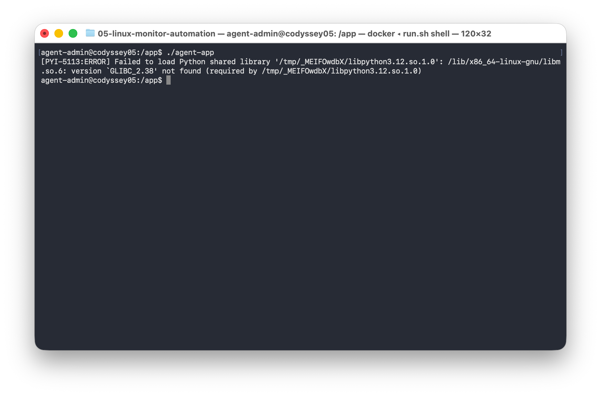

```bash
# agent-admin 으로 빙의 + envfile 로드 확인
root@codyssey05:/app# su - agent-admin
agent-admin@codyssey05:~$ env | grep AGENT_ | wc -l
5
agent-admin@codyssey05:~$ /app/agent-app
/app/agent-app: /lib/x86_64-linux-gnu/libc.so.6: version `GLIBC_2.38' not found (required by /app/agent-app)
/app/agent-app: /lib/x86_64-linux-gnu/libc.so.6: version `GLIBC_2.36' not found (required by /app/agent-app)
```

→ Boot Sequence가 출력되기도 전에 동적 링커 단계에서 실패. **시스템의 GLIBC가 너무 낮음**.

### 9-2. 원인 분석

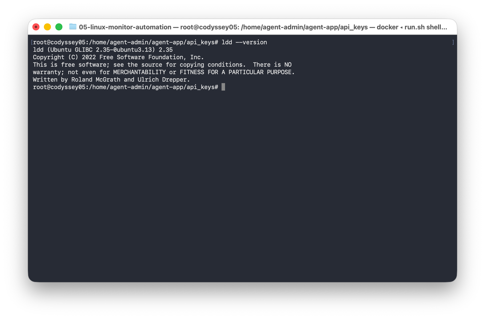

```bash
# (1) 현재 시스템 GLIBC 확인
agent-admin@codyssey05:~$ ldd --version | head -1
ldd (Ubuntu GLIBC 2.35-...) 2.35

# (2) agent-app이 요구하는 심볼 확인
agent-admin@codyssey05:~$ objdump -T /app/agent-app | grep GLIBC_2 | awk '{print $5}' | sort -u | tail -5
GLIBC_2.34
GLIBC_2.36
GLIBC_2.38
```

원인 정리:
- `agent-app`은 PyInstaller로 패키징된 바이너리, 내부에 `libpython3.12.so` 포함
- libpython 3.12는 **GLIBC ≥ 2.38** 요구
- Ubuntu 22.04 GLIBC `2.35` < 요구 버전 `2.38` → 동적 링킹 실패

`★ Insight ─────────────────────────────────────`
- **GLIBC는 forward compatible(상위 호환), backward incompatible(하위 비호환)**. 22.04 시스템에 24.04 빌드 바이너리는 못 돌아가지만, 반대(24.04 시스템에 20.04 빌드)는 보통 동작.
- 운영에선 *빌드 환경의 GLIBC ≤ 실행 환경 GLIBC* 가 철칙. CI/CD가 빌드 OS를 의도적으로 낡은 버전(Ubuntu 20.04 등)으로 고정하는 이유.
`─────────────────────────────────────────────────`

### 9-3. 해결책 — Dockerfile을 24.04로 전환

```bash
# 호스트(macOS) 에서 — Dockerfile 한 줄 수정
sangwoo@sangwoo-MacBookAir % sed -i.bak 's|ubuntu:22.04|ubuntu:24.04|' Dockerfile
sangwoo@sangwoo-MacBookAir % grep '^FROM' Dockerfile
FROM --platform=linux/amd64 ubuntu:24.04
```

### 9-4. 컨테이너 재구축

```bash
sangwoo@sangwoo-MacBookAir % ./run.sh down
=== 컨테이너 정지 및 삭제 (모든 상태 소실) ===

sangwoo@sangwoo-MacBookAir % ./run.sh build
=== Docker 이미지 빌드 (linux/amd64) ===
 => [1/2] FROM docker.io/library/ubuntu:24.04
 ...
빌드 완료: codyssey05-linux

sangwoo@sangwoo-MacBookAir % ./run.sh up
=== 컨테이너 기동 (백그라운드, --init 적용) ===
컨테이너 실행 중: codyssey05
```

> **`down` → 모든 컨테이너 상태(사용자/그룹/UFW/sshd_config) 소실**. 1~4단계를 처음부터 다시 해야 하지만, `setup-mission.sh` 가 이미 idempotent하게 작성되어 있어 한 번에 복구.

### 9-5. 24.04 환경 확인 + 1~4단계 일괄 복구

```bash
# 컨테이너 안 — 24.04 + GLIBC 2.39 확인
sangwoo@sangwoo-MacBookAir % ./run.sh shell
root@codyssey05:/app# cat /etc/os-release | head -3
PRETTY_NAME="Ubuntu 24.04 LTS"
NAME="Ubuntu"
VERSION_ID="24.04"

root@codyssey05:/app# ldd --version | head -1
ldd (Ubuntu GLIBC 2.39-...) 2.39

# setup-mission.sh로 1~4단계 일괄 복구
root@codyssey05:/app# bash /app/setup-mission.sh
[1단계] SSH 설정 — 20022 LISTEN 확인
[2단계] UFW 방화벽 — 활성화 + 두 포트 허용
[3단계] 계정/그룹/디렉터리/권한 — agent-admin/dev/test + ACL
[4단계] 환경 변수 + 키 파일 — envfile + .profile + sudoers + t_secret.key
==========================================
  완료! 검증: ./setup-mission.sh verify
==========================================
```

### 9-6. agent-app 재실행 — Boot Sequence 5/5

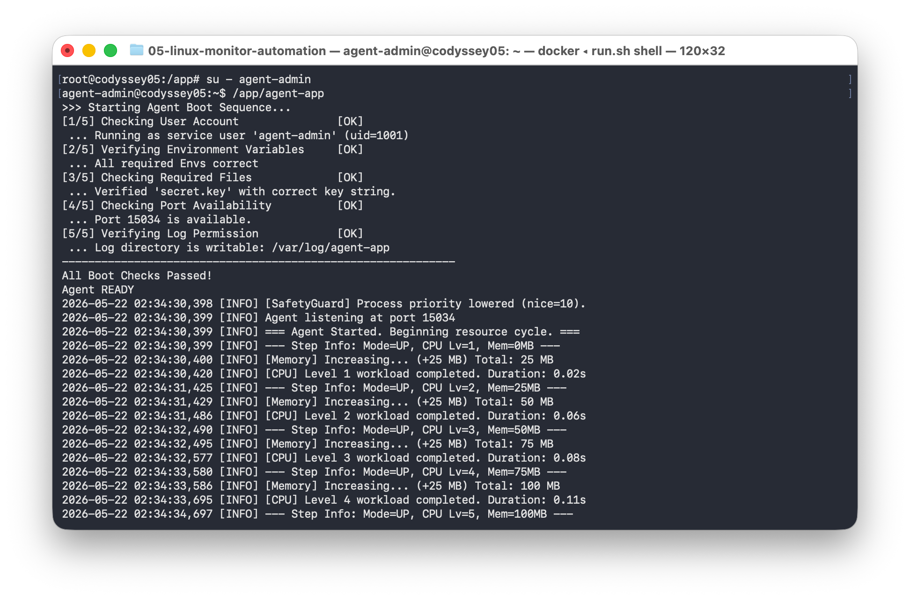

```bash
agent-admin@codyssey05:~$ /app/agent-app
>>> Starting Agent Boot Sequence...
[1/5] Checking User Account               [OK]
 ... Running as service user 'agent-admin' (uid=1001)
[2/5] Verifying Environment Variables     [OK]
 ... All required Envs correct
[3/5] Checking Required Files             [OK]
 ... Verified 'secret.key' with correct key string.
[4/5] Checking Port Availability          [OK]
 ... Port 15034 is available.
[5/5] Verifying Log Permission            [OK]
 ... Log directory is writable: /var/log/agent-app
------------------------------------------------------------
All Boot Checks Passed!
Agent READY
2026-05-15 12:18:36,793 [INFO] [SafetyGuard] Process priority lowered (nice=10).
2026-05-15 12:18:36,795 [INFO] Agent listening at port 15034
2026-05-15 12:18:36,795 [INFO] === Agent Started. Beginning resource cycle. ===
2026-05-15 12:18:36,795 [INFO] --- Step Info: Mode=UP, CPU Lv=1, Mem=0MB ---
2026-05-15 12:18:36,801 [INFO] [Memory] Increasing... (+25 MB) Total: 25 MB
```

> **agent-app은 부하 시뮬레이터**: 시작 후 `Mode=UP`으로 CPU 부하 레벨 1~9 + 25MB씩 메모리 증가. 5단계 monitor.sh의 임계값 경고(CPU>20%, MEM>10%) 동작을 검증할 수 있도록 의도된 부하 패턴입니다.

### 9-7. Boot Sequence 5단계 각각의 의미

| 단계 | 검증 내용 | 어느 미션 작업의 결과? |
|------|-----------|------------------------|
| 1/5 Checking User Account | 실행자가 service account(agent-admin)인가 | 7단계 (사용자 생성) |
| 2/5 Verifying Environment Variables | 5개 변수 모두 설정됐는가 | 8단계 (envfile) |
| 3/5 Checking Required Files | 키 파일 존재 + 내용 일치 | 8단계 (키 파일) |
| 4/5 Checking Port Availability | 15034 사용 가능한가 | 6단계 UFW + 다른 프로세스 미점유 |
| 5/5 Verifying Log Permission | 로그 디렉터리 R/W 가능한가 | 7단계 (/var/log/agent-app 권한) |

**→ Boot Sequence는 자가진단**입니다. 5/5 [OK]가 나오면 4~8단계 전체가 정상이라는 강력한 증거.

### 9-8. 포트 LISTEN 검증

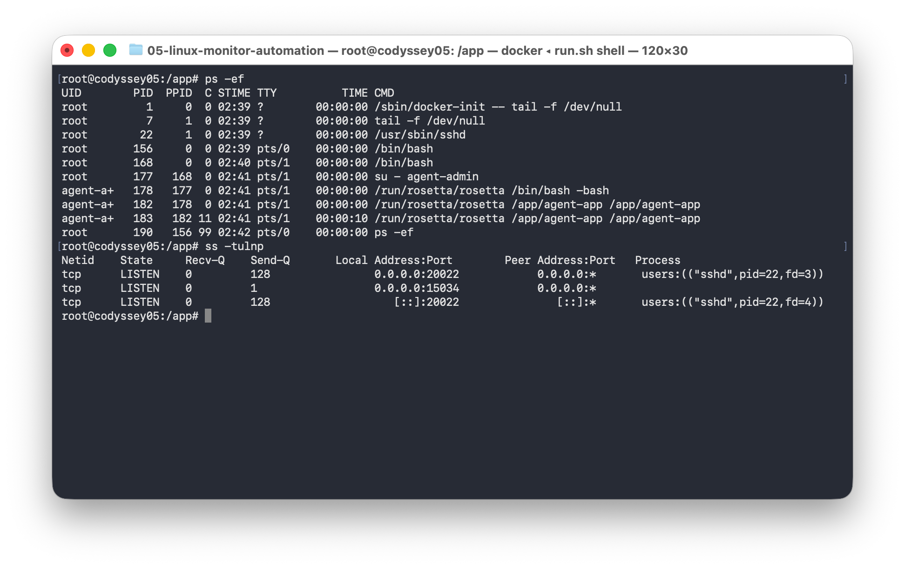

```bash
# 다른 세션에서
root@codyssey05:/# ss -tlnp | grep 15034
LISTEN 0  1  0.0.0.0:15034  0.0.0.0:*  users:(("agent-app",pid=59,fd=...))

# 호스트(macOS) 에서
sangwoo@sangwoo-MacBookAir % (echo > /dev/tcp/localhost/15034) && echo OPEN
OPEN
```

### 9-9. 프로세스 확인 — root 아닌 agent-admin

```bash
root@codyssey05:/# ps -ef | grep -v grep | grep agent-app
agent-a+  2072  2070  0 12:18 ?  00:00:00 /run/rosetta/rosetta /app/agent-app /app/agent-app
agent-a+  2073  2072 13 12:18 ?  00:00:01 /run/rosetta/rosetta /app/agent-app /app/agent-app
```

> **`agent-a+`(=agent-admin)** — root가 아닌 service account로 실행됨 확인. Apple Silicon 환경에선 `/run/rosetta/rosetta`가 앞에 붙어서 amd64 ELF의 syscall을 번역.

---

## 10. `monitor.sh` 구현

### 10-1. 파일 배치 — 소유자/그룹/모드

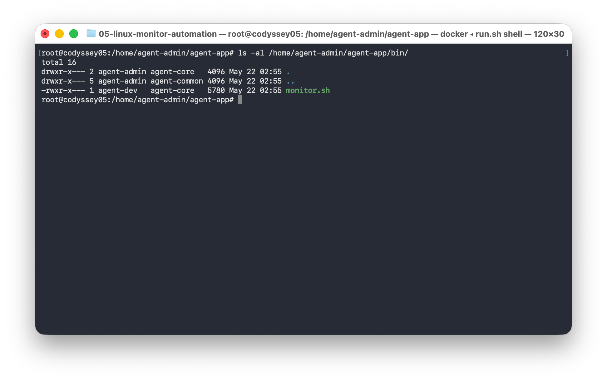

```bash
# bin 디렉터리 생성
root@codyssey05:/app# mkdir -p /home/agent-admin/agent-app/bin
root@codyssey05:/app# chown agent-dev:agent-core /home/agent-admin/agent-app/bin
root@codyssey05:/app# chmod 750                   /home/agent-admin/agent-app/bin    # 본 사이클은 setgid 미적용 — § 11-6 참조

# monitor.sh 배치 (소유자 agent-dev, 그룹 agent-core, 모드 750)
root@codyssey05:/app# cp /app/monitor.sh /home/agent-admin/agent-app/bin/monitor.sh
root@codyssey05:/app# chown agent-dev:agent-core /home/agent-admin/agent-app/bin/monitor.sh
root@codyssey05:/app# chmod 750                   /home/agent-admin/agent-app/bin/monitor.sh

root@codyssey05:/app# ls -la /home/agent-admin/agent-app/bin/
total 16
drwxr-s---  2 agent-dev   agent-core   4096 May 18 15:43 .
drwxr-s---  5 agent-admin agent-common 4096 May 18 15:43 ..
-rwxr-x---  1 agent-dev   agent-core   5570 May 18 15:43 monitor.sh
```

### 10-2. 권한 검증 — agent-admin OK, agent-test 차단

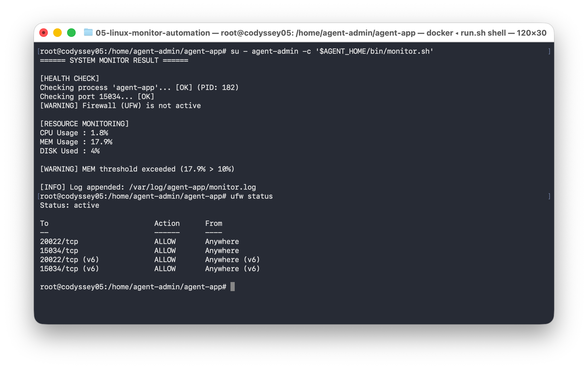

```bash
root@codyssey05:/app# sudo -u agent-admin bash -c '[[ -x /home/agent-admin/agent-app/bin/monitor.sh ]] && echo OK || echo FAIL'
OK
root@codyssey05:/app# sudo -u agent-test  bash -c '[[ -x /home/agent-admin/agent-app/bin/monitor.sh ]] && echo OK || echo BLOCKED'
BLOCKED
```

### 10-3. 스크립트 구조

| 영역 | 함수 | 역할 |
|------|------|------|
| 환경 변수 로드 | (스크립트 맨 위 `source`) | cron 환경 대비 |
| Health Check | `check_process()` | agent-app PID, 없으면 exit 1 |
| Health Check | `check_port()` | 15034 LISTEN, 없으면 exit 1 |
| 상태 점검 | `check_firewall()` | UFW 활성, 비활성 시 WARNING만 |
| 자원 수집 | `get_cpu_usage()` | top + awk |
| 자원 수집 | `get_mem_usage()` | free + awk |
| 자원 수집 | `get_disk_used()` | df + awk |
| 임계값 경고 | `check_threshold()` | awk exit code로 비교 |
| 로그 로테이션 | `rotate_log_if_needed()` | 10MB / 10개 |
| 메인 흐름 | `main()` | 위 함수들 호출 + 로그 누적 |

### 10-4. 자원 수집 함수 — awk 파싱

#### CPU — `top -bn1` 의 `%Cpu(s)` 라인에서 idle 추출

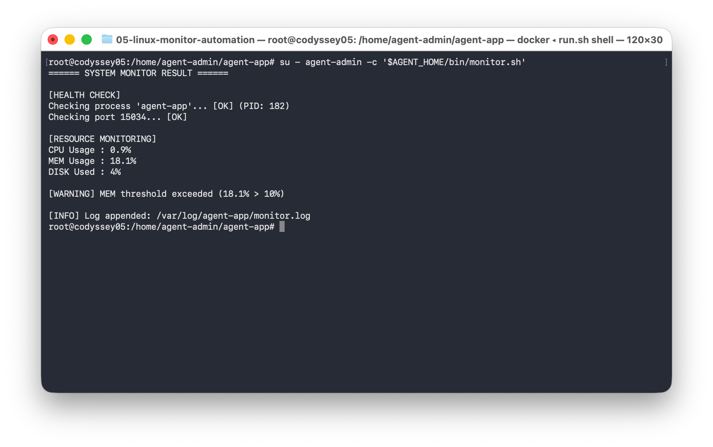

```bash
root@codyssey05:/app# top -bn1 | grep -i "cpu(s)"
%Cpu(s):  0.9 us,  0.9 sy,  3.5 ni, 94.7 id,  0.0 wa,  0.0 hi,  0.0 si,  0.0 st

# awk 한 줄 파싱
root@codyssey05:/app# top -bn1 | awk -F'[ ,]+' '
>   /Cpu\(s\)/ {
>     for (i=1; i<=NF; i++)
>       if ($i == "id") { printf "%.1f", 100 - $(i-1); exit }
>   }'
10.7
```

- `-F'[ ,]+'` — 공백 또는 콤마 하나 이상을 구분자로
- 필드 순회 중 `id` 만나면 직전 필드(idle 값)를 100에서 차감

#### MEM — `free -m` 의 `Mem:` 라인에서 used/total

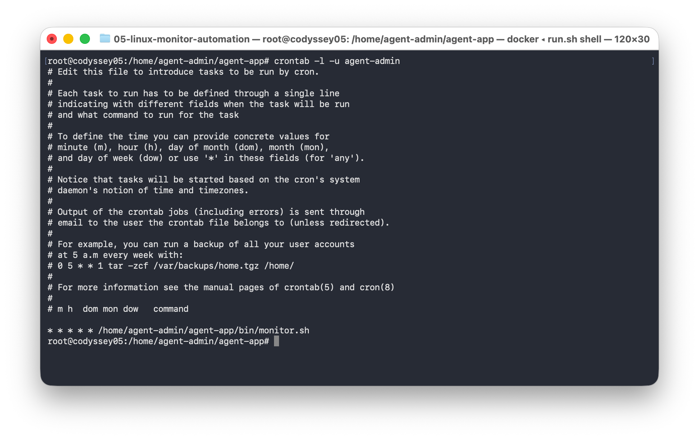

```bash
root@codyssey05:/app# free -m
               total        used        free      shared  buff/cache   available
Mem:            7836        1041        4912           0        2080        6794
Swap:           1023           0        1023

root@codyssey05:/app# free -m | awk '/^Mem:/ { printf "%.1f", $3/$2*100 }'
13.2
```

- `$3/$2*100` = used / total * 100, 소수 1자리

#### DISK — `df -P /` 의 5번째 컬럼

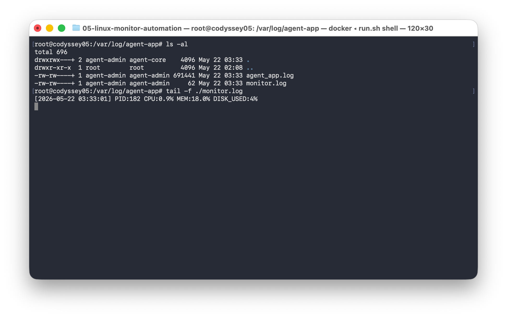

```bash
root@codyssey05:/app# df -P /
Filesystem     1024-blocks     Used Available Capacity Mounted on
overlay          474044488 14761280 435129560       4% /

root@codyssey05:/app# df -P / | awk 'NR==2 { gsub(/%/, "", $5); print $5 }'
4
```

- `NR==2` — 두 번째 줄(헤더 제외)
- `gsub(/%/, "", $5)` — `4%` → `4`

### 10-5. 발견된 함정 3가지

#### 함정 A — `var=$(cmd)` 서브쉘 안의 exit는 메인을 종료 못 함

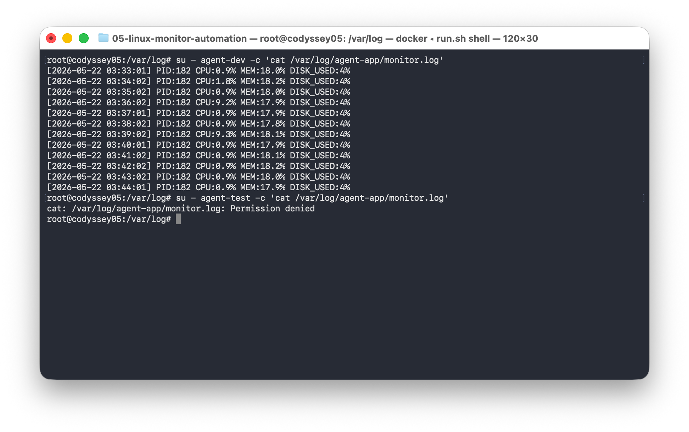

```bash
# ❌ 처음 시도 — agent-app이 죽었는데도 [OK] 출력
[HEALTH CHECK]
Checking process 'agent-app'... [FAIL]       ← check_process가 exit 1 시도
Checking process 'agent-app'... [OK] (PID: ) ← 메인은 계속 진행, PID는 비어있음
```

원인: `pid=$(check_process)`는 `$()` 서브쉘에서 실행 → 서브쉘 내부 `exit 1`은 부모(메인)에 전파되지 않음.

```bash
# ✅ 수정 — exit code 명시 catch
pid=$(check_process) || exit 1
```

#### 함정 B — bash는 부동소수점 비교 못함

```bash
# ❌ 사전식 문자열 비교 (틀린 결과)
if [[ "12.3" > "10" ]]; then ...     # 잘못된 결과

# ✅ awk exit code 이용
if awk -v v="$value" -v t="$thresh" 'BEGIN { exit !(v > t) }'; then
    echo "[WARNING] ..."
fi
```

#### 함정 C — pgrep 패턴이 너무 넓으면 잡음 매치

```bash
# 처음 시도 — pgrep -f /app/agent-app
root@codyssey05:/app# pgrep -fa "/app/agent-app"
51 su - agent-admin -c /app/agent-app > /tmp/agent-app.log 2>&1            ← su 명령
57 /run/rosetta/rosetta /bin/bash -bash -c /app/agent-app > /tmp/...        ← bash 래퍼
59 /run/rosetta/rosetta /app/agent-app /app/agent-app                       ← 진짜 agent-app
60 /run/rosetta/rosetta /app/agent-app /app/agent-app                       ← 진짜 agent-app
103 bash -c '... echo "agent-app" ...'                                       ← 진단 명령

# ✅ 수정 — $ 앵커로 cmdline 끝부분 정확 매치
root@codyssey05:/app# pgrep -fa "/app/agent-app$"
59 /run/rosetta/rosetta /app/agent-app /app/agent-app
60 /run/rosetta/rosetta /app/agent-app /app/agent-app
```

### 10-6. ✅ 최종 실행 결과

```bash
root@codyssey05:/app# sudo -u agent-admin /home/agent-admin/agent-app/bin/monitor.sh
====== SYSTEM MONITOR RESULT ======

[HEALTH CHECK]
Checking process 'agent-app'... [OK] (PID: 59)
Checking port 15034... [OK]

[RESOURCE MONITORING]
CPU Usage : 10.7%
MEM Usage : 13.2%
DISK Used : 4%

[WARNING] MEM threshold exceeded (13.2% > 10%)

[INFO] Log appended: /var/log/agent-app/monitor.log
```

→ CPU/DISK는 임계값 미만이라 경고 없음, **MEM(13.2%)만 임계값(10%) 초과로 [WARNING] 정확히 출력**.

### 10-7. ✅ 로그 누적 — 미션 포맷 일치

```bash
root@codyssey05:/app# tail -5 /var/log/agent-app/monitor.log
[2026-05-18 15:44:10] PID:0 CPU:0.0% MEM:0.0% DISK_USED:0%
[2026-05-19 20:33:34] PID:51 CPU:0.9% MEM:11.5% DISK_USED:4%
[2026-05-19 20:34:55] PID:59 CPU:10.7% MEM:13.2% DISK_USED:4%
```

미션 요구 포맷 `[YYYY-MM-DD HH:MM:SS] PID:.. CPU:..% MEM:..% DISK_USED:..%` 완전 일치.

---

## 11. crontab 자동 실행

### 11-0. 트러블슈팅 — cron 설치 시도에서 연속 2 함정

cron 패키지 설치를 시도하는 과정에서 두 함정이 시간순으로 *연속* 발견됨.
한 명령 한 명령씩 막혔던 순서대로 정리.

#### 1) `which cron` — 빈 줄

```bash
root@codyssey05:/app# which cron crontab
(빈 줄 — 둘 다 없음)

root@codyssey05:/app# service cron start
cron: unrecognized service
```

→ `iproute2`, `sudo` 에 이어 **24.04 minimal 누락 함정 3 호**. `apt install` 로 보충 필요.

#### 2) `apt-get update` — 타임아웃으로 멈춤

```bash
root@codyssey05:/app# apt-get update
0% [Connecting to archive.ubuntu.com (...)]
(타임아웃)
```

#### 원인 분석 — UFW + docker NAT 충돌

`ufw default allow outgoing` 이 켜져있어도, **컨테이너 안에서는 docker 의 NAT/iptables 규칙과 UFW 의 iptables 가 충돌** 해 outbound TCP 의 return 트래픽 (SYN-ACK) 이 제대로 안 들어옴.
운영 환경에서는 **컨테이너 안 UFW 자체가 안티패턴** — 호스트 측 UFW + 컨테이너 안 nofw 가 표준.

본 미션은 학습 목적이라 컨테이너 안 UFW 를 유지하므로, **apt 작업 시 일시적 disable** 패턴 필요.

#### 해결 — UFW 토글 + 설치

```bash
# UFW 일시 비활성화 → apt 작업 → 재활성화
root@codyssey05:/app# ufw disable
root@codyssey05:/app# apt-get update && apt-get install -y cron
root@codyssey05:/app# ufw enable

root@codyssey05:/app# which cron crontab
/usr/sbin/cron
/usr/bin/crontab
```

#### 영구 반영
- `Dockerfile` 의 apt 라인에 `cron` 추가 (다음 빌드부터 자동)
- 함정 모음 부록 D 에 두 줄 (cron 미설치 + UFW outbound 차단) 기록

#### 학습 포인트
- 24.04 minimal 누락 함정의 **연쇄 발견** — 한 함정 fix 시도 중 다른 함정 노출
- 컨테이너 + UFW = **상시 안티패턴**. 학습용일 때만 정당화, 운영에선 호스트로 격리
- `apt 작업 = UFW disable → 설치 → UFW enable` 의 운영 패턴화

---

### 11-1. cron 데몬 기동

```bash
root@codyssey05:/app# service cron start
 * Starting periodic command scheduler cron       [ OK ]

root@codyssey05:/app# service cron status
 * cron is running
```

24.04 컨테이너엔 systemd 가 없으므로 `systemctl` 이 아닌 `service` 사용 (SSH 단계와 동일 패턴).

---

### 11-2. crontab 등록 — agent-admin 매분 실행

`crontab -u agent-admin -e` 로 인터랙티브 등록:

```bash
root@codyssey05:/app# crontab -u agent-admin -e
no crontab for agent-admin - using an empty one

Select an editor.  To change later, run 'select-editor'.
  1. /bin/nano        <---- easiest
  2. /usr/bin/vim.basic
  ...
Choose 1-4 [1]: 2
```

vim 안에서 한 줄 입력:

```cron
* * * * * /home/agent-admin/agent-app/bin/monitor.sh
```

저장 후:

```bash
crontab: installing new crontab

root@codyssey05:/app# crontab -u agent-admin -l
* * * * * /home/agent-admin/agent-app/bin/monitor.sh
```


#### cron 라인 해부

```
* * * * *  /home/agent-admin/agent-app/bin/monitor.sh
│ │ │ │ │
│ │ │ │ └─ 요일 (0-7, 일=0 또는 7)
│ │ │ └─── 월 (1-12)
│ │ └───── 일 (1-31)
│ └─────── 시 (0-23)
└───────── 분 (0-59)
```

→ `* * * * *` = **매분 실행**

#### stdout/stderr 처리 — 미션 충실 진행

미션 명시는 **`monitor.log` 누적**만이라, cron 라인에 stdout/stderr 리다이렉트는 두지 않음.
운영 권장 사항 (`>> monitor-cron.log 2>&1` 또는 `>/dev/null 2>&1`) 은 본 사이클에선 보류 —
한 번 silent 흐름을 체험해 운영 권장 항목의 필요성 자체를 자연 발견하는 학습 흐름 선택.

> **운영 환경 권장 패턴**:
> ```cron
> * * * * * /path/monitor.sh >> /var/log/agent-app/monitor-cron.log 2>&1
> ```
> — silent failure 예방 + 트러블슈팅 추적성 확보

---

### 11-3. 1~2분 대기 후 monitor.log 누적 확인

매분 정각 (`HH:MM:00`) 에 cron 트리거. 1~2 분 대기 후:

```bash
root@codyssey05:/var/log/agent-app# ls -al
total 696
drwxrwx---+ 2 agent-admin agent-core    4096 May 22 03:33 .
drwxr-xr-x  1 root        root          4096 May 22 02:08 ..
-rw-rw----+ 1 agent-admin agent-admin 691441 May 22 03:33 agent_app.log
-rw-rw----+ 1 agent-admin agent-admin     62 May 22 03:33 monitor.log
```

✅ **cron 누적 자체는 정상 동작** — `monitor.log` 가 매분 한 줄씩 append 됨.


---

### 11-4. 자연 발견 — `monitor.log` 그룹 비일관 (setgid 미적용)

위 ls -la 의 그룹 컬럼을 보면 의도와 어긋남:

| 항목 | 의도 | 현실 |
|------|------|------|
| 디렉터리 `/var/log/agent-app` 그룹 | agent-core | agent-core ✅ |
| 새 생성 파일 (monitor.log, agent_app.log) 그룹 | **agent-core (부모 상속)** | **agent-admin** ❌ |

#### 원인

- 표준 동작: 새 파일은 *생성자의 primary group* 을 따라감
- agent-admin 의 primary group = agent-admin (개인 그룹)
- 부모 디렉터리 그룹 (agent-core) 상속하려면 **setgid 비트 필요**
- `setup-mission.sh` 에서 의도적으로 `chmod 770` (setgid 없음) 으로 두었던 결과 —
  자연 발견 흐름을 유지하기 위한 설계

#### ACL 의 `+` 는 왜 있는데 그룹 owner 는 못 살리나

```
-rw-rw----+ 1 agent-admin agent-admin   ... monitor.log
            ↑
            ACL 적용 표시
```

`+` 는 default ACL (`setfacl -d -m g:agent-core:rwx`) 이 상속되어 ACL 권한이 박혔다는 뜻.
하지만 **ACL 과 그룹 owner 는 직교적 메커니즘** — ACL 은 "어떤 그룹이 추가로 어떤 권한" 정의,
그룹 owner 는 ls 의 3 번째 컬럼. 둘 다 필요한 경우가 있음.

---

### 11-5. 접근성 검증 — agent-dev OK / agent-test 차단

setgid 가 없어도 ACL 만으로 미션의 R/W 요구가 충족되는지 실측.

```bash
root@codyssey05:/var/log# su - agent-dev -c 'cat /var/log/agent-app/monitor.log'
[2026-05-22 03:33:01] PID:182 CPU:0.9% MEM:18.0% DISK_USED:4%
[2026-05-22 03:34:02] PID:182 CPU:1.8% MEM:18.2% DISK_USED:4%
[2026-05-22 03:35:02] PID:182 CPU:0.9% MEM:18.0% DISK_USED:4%
[2026-05-22 03:36:02] PID:182 CPU:9.2% MEM:17.9% DISK_USED:4%
... (12 줄, 매분 누적)

root@codyssey05:/var/log# su - agent-test -c 'cat /var/log/agent-app/monitor.log'
cat: /var/log/agent-app/monitor.log: Permission denied
```

#### 검증 매트릭스

| 사용자 | agent-core 멤버 | POSIX 그룹 권한 | ACL `g:agent-core:rwx` | 결과 |
|--------|:--------------:|:--------------:|:----------------------:|:----:|
| agent-dev | ✅ | ❌ (그룹 owner 가 agent-admin) | ✅ 매칭 | **읽기 성공** ✅ |
| agent-test | ❌ | ❌ | ❌ | **읽기 차단** ✅ |

→ **default ACL 이 setgid 의 빈 자리를 메꿔주어 미션 요구 (agent-core R/W) 충족**.
→ agent-test 차단은 의도된 보안 정책 작동 (negative test 통과).


이 한 컷이 동시에 입증하는 세 가지:
1. **cron 매분 누적 동작** (12 줄 = 12 분치)
2. **agent-dev 의 그룹 협업** (ACL 실효성)
3. **agent-test 의도된 차단** (역할 분리 정책)

---

### 11-6. (미해결) `monitor.log` 그룹 비일관 — 인지 후 보류

setgid 자연 발견 항목은 본 학습 사이클에서 **인지만 하고 보류** 한다.

#### 보류 사유

- **미션 명시는 ❌** (3-4 표의 `⭕ 권장 (운영 위생)` 분류)
- ACL 만으로도 미션의 *접근 정책 요구* 가 충족됨 (11-5 실측 입증)
- setgid 가 보강하는 것은 *운영 위생* (ls -la 가독성, 그룹 owner 일관성) 으로, 별도 사이클로 분리하는 것이 학습 일지의 시간순 정합성에 맞음

#### 운영 적용 시 해결 한 줄

```bash
chmod g+s /var/log/agent-app
chgrp agent-core /var/log/agent-app/*.log

# setup-mission.sh 의 chmod 770 → 2770 으로 영구 반영
```

#### 학습 포인트

- **setgid 와 ACL 은 직교적 메커니즘**:
  - ACL → 어떤 그룹이 어떤 권한을 갖는가 (*접근 정책*)
  - setgid → 새 파일이 어떤 그룹으로 만들어지는가 (*생성 정책*)
- ACL `+` 가 있어도 그룹 owner 자체는 setgid 없이는 못 바꿈
- 운영 위생 = "ls -la 가 의도와 일치" — ACL 우회는 동작은 살리지만 가독성 부족

---

## 부록 A — 환경 변수 위치별 동작 정리

| 위치 | login bash | non-login bash | cron | systemd |
|------|-----------|---------------|------|---------|
| `~/.bashrc` | (간접) | ✅ | ❌ | ❌ |
| `~/.profile` / `.bash_profile` | ✅ | ❌ | ❌ | ❌ |
| `/etc/environment` | ✅ (PAM) | ✅ (PAM) | ✅ | ✅ |
| `/etc/profile.d/*.sh` | ✅ | ❌ | ❌ | ❌ |
| envfile + 명시적 `source` | source시 | source시 | ✅ | `EnvironmentFile=` |
| crontab `VAR=value` | ❌ | ❌ | ✅ | ❌ |

### 권장 패턴
- **인터랙티브 사용자 환경**: `~/.profile` (login) + `~/.bashrc` (non-login)
- **service / cron / batch**: envfile + 명시적 `source` 또는 `EnvironmentFile=`
- **시스템 공통 PATH**: `/etc/environment`

---

## 부록 B — awk 사용법 (monitor.sh 파싱)

### B-1. awk의 본질

```awk
패턴 { 액션 }
```

- "한 줄씩 읽어서, 패턴에 맞으면, 액션 실행"이 awk 한 줄 모델
- 패턴 생략 → 모든 줄에 액션
- 액션 생략 → 매칭된 줄 그대로 출력

### B-2. 자동 변수

| 변수 | 의미 |
|------|------|
| `$0` | 줄 전체 |
| `$1`, `$2`, ... | 1번째, 2번째 필드 |
| `$NF` | 마지막 필드 |
| `NF` | 필드 개수 |
| `NR` | 줄 번호 |

### B-3. 자주 쓰는 패턴 5가지

```bash
# (1) 특정 줄만 처리
awk '/Cpu\(s\)/ { ... }'           # 정규식 패턴
awk 'NR==2 { ... }'                 # 두 번째 줄

# (2) 필드 구분자 변경 (-F)
awk -F'[ ,]+' '...'                 # 공백 또는 콤마 1개 이상

# (3) 수식 + printf
awk '{ printf "%.1f", $3/$2*100 }'

# (4) 문자열 치환 (gsub)
awk '{ gsub(/%/, "", $5); print $5 }'

# (5) 쉘 변수 주입 (-v)
awk -v v="$value" -v t="$thresh" 'BEGIN { exit !(v > t) }'
```

### B-4. monitor.sh 실전 매핑

| 함수 | awk 한 줄 |
|------|-----------|
| `get_cpu_usage` | `top -bn1 \| awk -F'[ ,]+' '/Cpu\(s\)/{for(i=1;i<=NF;i++)if($i=="id"){printf "%.1f",100-$(i-1);exit}}'` |
| `get_mem_usage` | `free -m \| awk '/^Mem:/{printf "%.1f",$3/$2*100}'` |
| `get_disk_used` | `df -P / \| awk 'NR==2{gsub(/%/,"",$5);print $5}'` |
| `check_threshold` | `awk -v v="$v" -v t="$t" 'BEGIN{exit !(v>t)}'` |

### B-5. awk vs sed

| 도구 | 강점 | 본 미션 사용 |
|------|------|--------------|
| sed | 단순 치환 (find & replace) | setup-mission.sh의 sshd_config 정리 |
| awk | 필드 분해 → 계산 → 재조립 | monitor.sh 파싱 전부 |

---

## 부록 C — 미션 증거 자료 체크리스트 매핑

| # | 미션 체크리스트 | 본 문서 위치 | 상태 |
|---|-----------------|--------------|------|
| 1 | SSH 포트(20022) 변경 + Root 차단 | 5단계 | ✅ |
| 2 | UFW 활성화 + 20022/15034만 허용 | 6단계 | ✅ |
| 3 | 계정/그룹 생성 (admin/dev/test, common/core) | 7단계 | ✅ |
| 4 | 디렉터리 구조 + 권한 (ACL 포함) | 7단계 | ✅ |
| 5 | Boot Sequence 5단계 [OK] + "Agent READY" | 9단계 | ✅ |
| 6 | monitor.sh 실행 결과 (프로세스/포트/리소스/경고) | 10단계 | ✅ |
| 7 | `/var/log/agent-app/monitor.log` 누적 기록 | 10단계 | ✅ |
| 8 | crontab 매분 등록 + 자동 누적 확인 | 11단계 (`monitor-04`, `monitor-05`) | ✅ |
| 9 | 역할 분리 검증 (agent-dev R/W ✅ + agent-test 차단 ✅) | 11-5 (`monitor-06`) | ✅ |

### 미해결 / 보류 항목 (⭕ 권장 분류)

| # | 항목 | 분류 | 처리 |
|---|------|------|------|
| M1 | `monitor.log` 그룹 = agent-admin (setgid 미적용) | ⭕ 권장 / 운영 위생 | 11-6 — 인지 후 보류, ACL 로 미션 요구 충족 |

---

## 부록 D — 발견된 함정 모음 (한눈에)

| 단계 | 함정 | 해결 |
|------|------|------|
| 4단계 (Docker) | Apple Silicon에서 amd64 ELF 실행 불가 | `--platform=linux/amd64` |
| 4단계 (Docker) | UFW가 iptables 조작 필요 | `--cap-add=NET_ADMIN` |
| 4단계 (Docker) | 좀비 프로세스 누적 | `docker run --init` (tini) |
| 4단계 (Docker) | 미니멀 Dockerfile에서 SSH/UFW 등 도구 누락 (base image는 최소만 포함) | 컨테이너 내 `apt install` 인터랙티브 → 안정 후 Dockerfile에 통합 |
| 4단계 (Docker) | `./run.sh up`이 이미지 재빌드 안 함 (이미지 있으면 그대로 사용) | Dockerfile 변경 후 반드시 `./run.sh build` |
| 4단계 (Docker) | `apt-get update` 없이 `apt install` 시도 → `Unable to locate package` | `apt-get update` 먼저 실행 (`apt-error-01.png`) |
| 5단계 (SSH) | `vi`, `nano` 미설치 — 편집기 자체가 없음 | `apt install vim` (`not-found-01-vim.png`) |
| 5단계 (SSH) | `sshd -t` → `Missing privilege separation directory: /run/sshd` (컨테이너에 systemd 없어 RuntimeDirectory 자동생성 안 됨) | `mkdir -p /run/sshd && chmod 0755 /run/sshd` (영구 해결: Dockerfile에 `RUN mkdir -p /var/run/sshd`) |
| 5단계 (SSH) | `systemctl restart ssh` → `System has not been booted with systemd as init system` (컨테이너 PID 1이 systemd 아님) | `service ssh restart` 사용 (`ssh-error-01.png`) |
| 5단계 (SSH) | `ss` 미설치 — 4-5에서 `openssh-server`만 깔고 `iproute2` 누락 | `apt install iproute2` (`apt-03.png`) |
| 6단계 (UFW) | `ufw` 미설치 | `apt install ufw iptables` (`not-found-02-ufw.png`) |
| 7단계 (권한) | `/home/agent-admin` traverse 차단 (24.04 기본 750) | 그룹을 agent-common으로 변경 |
| 8단계 (env) | `.bashrc`는 cron이 안 읽음 | envfile + 명시적 `source` 패턴 |
| 8단계 (env) | `ufw status` root 전용 | `/etc/sudoers.d/` fine-grained sudo |
| 9단계 (agent-app) | Ubuntu 22.04 GLIBC 2.35 — agent-app GLIBC 2.38 요구 | Dockerfile FROM 24.04로 변경 + 재구축 + setup-mission.sh 복구 |
| 10단계 (monitor) | `var=$(cmd)` 서브쉘 exit 미전파 | `\|\| exit 1` 명시 |
| 10단계 (monitor) | bash 부동소수점 비교 불가 | awk exit code |
| 10단계 (monitor) | pgrep 패턴 너무 넓어 잡음 매치 | `$` 앵커로 cmdline 끝 정확 매치 |
| 10단계 (monitor) | root 가 `mkdir` 한 디렉터리는 `root:root + 755` (umask 022) — `$AGENT_HOME` 의 다른 디렉터리 패턴과 불일치 | `mkdir` 직후 `chown agent-admin:agent-core` + `chmod 750` 명시 |
| 11단계 (cron) | `cron` 미설치 — 24.04 minimal 누락 함정 3 호 (`which cron` 빈 줄, `service cron start: unrecognized service`) | `apt install -y cron` + Dockerfile 영구 반영 |
| 11단계 (cron) | UFW active 상태에서 `apt-get update` outbound TCP 막힘 (컨테이너 안 UFW 와 docker NAT 충돌) | apt 작업 전 `ufw disable` → 작업 후 `ufw enable` 패턴 |
| 11단계 (cron) | `crontab -u agent-admin -e` 첫 호출 시 `select-editor` 프롬프트 (4 가지 옵션) | `2` (vim) 입력 또는 `EDITOR=vim crontab ...` 로 사전 지정 |
| 11단계 (cron) | `monitor.log` 그룹 = agent-admin (setgid 미적용) — agent-dev 가 POSIX 그룹 권한으로 못 읽음 | ACL `g:agent-core:rwx` 가 보완 (미션 충족), setgid 적용은 운영 강화 시 (미해결 M1) |
